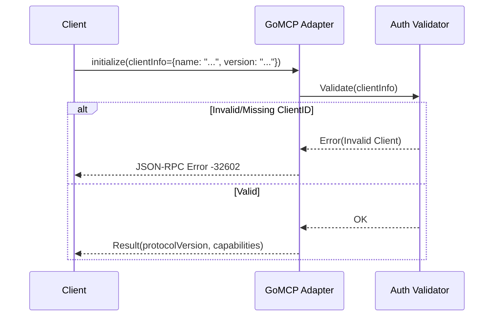

# Design: GoMCP OAuth Hardening

## Architecture

To prevent "Shared Client ID" attacks, we will enforce strict Client Identification during the MCP initialization handshake.



## Data Models

### [MODIFY] `pkg/stdio/stdio.go`

Add strict typing for `initialize` params:

```go
type InitializeParams struct {
    ProtocolVersion string      `json:"protocolVersion"`
    Capabilities    Capabilities `json:"capabilities"`
    ClientInfo      ClientInfo  `json:"clientInfo"` 
}

type ClientInfo struct {
    Name    string `json:"name"`
    Version string `json:"version"`
}
```


## Component Changes (Clean Architecture)

### 1. Domain Layer (`pkg/security`)
We will introduce a dedicated security package to encapsulate auth policies, avoiding logic leakage into the transport layer.

- **Interface:** `ClientValidator`
```go
type ClientValidator interface {
    Validate(ctx context.Context, clientInfo auth.ClientInfo) error
}
```
- **Implementation:** `StrictValidator` (checks against rules/blocklists)

### 2. Transport Layer (`pkg/stdio`)
- **Dependency Injection:** `Adapter` struct will receive `ClientValidator` in its constructor.
- **Logic:** `handleInitialize` delegates to `validator.Validate()`. The adapter is only responsible for Protocol mapping, not Business Logic.

### 3. Composition Root (`cmd/gomcp-server/main.go`)
- Wire up the dependencies:
```go
validator := security.NewStrictValidator()
adapter := stdio.NewAdapter(stdio.Config{
    Handler: handler,
    Validator: validator,
})
```
