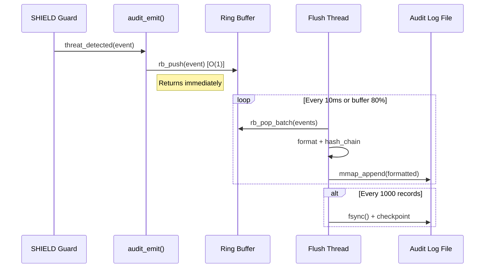

# Документ технического дизайна

## Обзор
**Назначение**: Модуль SHIELD Audit Logging обеспечивает детальное логирование всех security-событий для compliance (SOC 2, HIPAA, PCI-DSS).

**Пользователи**: SOC-аналитики, compliance-офицеры, DevOps инженеры.

**Влияние**: Расширяет SHIELD новым модулем `audit/` без изменения существующего flow обработки запросов.

### Цели
- Запись всех security-событий с латентностью <50μs
- Неизменяемость логов с cryptographic integrity
- Интеграция с SIEM через стандартные форматы (CEF/LEEF/syslog)

### Не-цели
- Real-time alerting (scope IMMUNE)
- Long-term storage management (external S3/archiver)
- Log analytics/search (external ELK/Splunk)

## Архитектура

### Архитектурный паттерн и границы

```
┌─────────────────────────────────────────────────────────────┐
│                        SHIELD                                │
│  ┌──────────┐     ┌──────────────┐     ┌─────────────────┐  │
│  │ Request  │────▶│   Guards/    │────▶│  audit_emit()   │  │
│  │ Handler  │     │  Detection   │     │  (inline hook)  │  │
│  └──────────┘     └──────────────┘     └────────┬────────┘  │
│                                                  │           │
│                                    ┌─────────────▼─────────┐ │
│                                    │    Ring Buffer        │ │
│                                    │   (lock-free SPSC)    │ │
│                                    └─────────────┬─────────┘ │
│                                                  │           │
└──────────────────────────────────────────────────┼───────────┘
                                                   │
                              ┌────────────────────▼───────────┐
                              │      Flush Thread              │
                              │  ┌─────────┐ ┌──────────────┐  │
                              │  │Formatter│ │ Hash Chain   │  │
                              │  │(JSONL/  │ │ (SHA-256)    │  │
                              │  │CEF/LEEF)│ └──────────────┘  │
                              │  └────┬────┘                   │
                              │       │                        │
                              │  ┌────▼────┐ ┌──────────────┐  │
                              │  │  File   │ │   Export     │  │
                              │  │ Writer  │ │ (syslog/S3)  │  │
                              │  └─────────┘ └──────────────┘  │
                              └────────────────────────────────┘
```

**Интеграция с архитектурой**:
- Паттерн: Producer-Consumer с lock-free ring buffer
- Inline hook `audit_emit()` — O(1), non-blocking
- Flush thread — dedicated, не блокирует request path

### Технологический стек

| Слой | Выбор | Роль | Заметки |
|------|-------|------|---------|
| Core | C11 | Ring buffer, hash chain | Zero-dependency |
| Crypto | OpenSSL SHA-256 | Integrity | Already in SHIELD |
| I/O | mmap + fsync | File persistence | Minimal syscalls |
| Export | BSD sockets | syslog/webhook | Standard POSIX |

## Системные потоки

### Поток записи события



## Трассируемость требований

| Требование | Краткое | Компоненты | Интерфейсы |
|------------|---------|------------|------------|
| 1.1-1.4 | Запись событий | audit_emit, ring_buffer | AuditEvent struct |
| 2.1-2.4 | Форматы логов | formatter_* | AuditFormatter |
| 3.1-3.4 | Целостность | hash_chain | HashChain struct |
| 4.1-4.4 | Ротация | log_rotator | RotationConfig |
| 5.1-5.4 | Экспорт | exporter_* | ExportTarget |
| 6.1-6.4 | Производительность | ring_buffer, metrics | AuditMetrics |

## Компоненты и интерфейсы

| Компонент | Слой | Назначение | Req | Зависимости |
|-----------|------|------------|-----|-------------|
| audit_core | Core | Initialization, config | 1-6 | config.h |
| ring_buffer | Utils | Lock-free SPSC queue | 6 | stdatomic.h |
| hash_chain | Crypto | SHA-256 integrity | 3 | OpenSSL |
| formatter_jsonl | Format | JSONL output | 2 | - |
| formatter_cef | Format | CEF output | 2 | - |
| log_rotator | I/O | File rotation | 4 | - |
| exporter_syslog | Export | Syslog sender | 5 | BSD sockets |

### Core Layer

#### audit_core

| Поле | Детали |
|------|--------|
| Назначение | Инициализация и управление lifecycle модуля |
| Требования | 1.1-1.4, 6.1-6.4 |

**Обязанности**:
- Инициализация ring buffer и flush thread
- Загрузка конфигурации
- Graceful shutdown с flush

**Контракты**: Service [x] / State [x]

##### Service Interface
```c
// shield/src/audit/audit.h

typedef struct {
    size_t ring_buffer_size;    // Default: 65536 events
    size_t flush_interval_ms;   // Default: 10
    size_t checkpoint_interval; // Default: 1000 records
    const char* log_path;       // Default: "/var/log/shield/audit.log"
    AuditFormat format;         // AUDIT_FMT_JSONL | CEF | LEEF
} AuditConfig;

typedef struct {
    uint64_t timestamp_ns;
    uint32_t event_type;        // AUDIT_DETECT | BLOCK | BYPASS_ATTEMPT
    uint32_t severity;          // 1-10
    uint32_t source_ip;
    char request_id[37];        // UUID
    char rule_matched[64];
    char payload_hash[65];      // SHA-256 hex
} AuditEvent;

// Lifecycle
int audit_init(const AuditConfig* config);
void audit_shutdown(void);

// Emit (inline, non-blocking)
int audit_emit(const AuditEvent* event);

// Metrics
typedef struct {
    uint64_t events_logged;
    uint64_t events_dropped;
    uint64_t avg_write_latency_ns;
    float buffer_utilization;
} AuditMetrics;

int audit_get_metrics(AuditMetrics* out);
```

- **Preconditions**: audit_init() called with valid config
- **Postconditions**: Event queued or dropped counter incremented
- **Invariants**: Ring buffer never blocks, always O(1)

#### ring_buffer

| Поле | Детали |
|------|--------|
| Назначение | Lock-free single-producer single-consumer queue |
| Требования | 6.1-6.4 |

##### State Management
```c
typedef struct {
    AuditEvent* buffer;
    size_t capacity;
    _Atomic size_t head;  // Producer writes here
    _Atomic size_t tail;  // Consumer reads here
} RingBuffer;

int rb_init(RingBuffer* rb, size_t capacity);
int rb_push(RingBuffer* rb, const AuditEvent* event);  // Returns -1 if full
int rb_pop_batch(RingBuffer* rb, AuditEvent* out, size_t max_count, size_t* actual);
void rb_destroy(RingBuffer* rb);
```

- **Concurrency**: Single producer (request thread), single consumer (flush thread)
- **Backpressure**: Drop oldest on overflow, increment dropped counter

### Crypto Layer

#### hash_chain

```c
typedef struct {
    uint8_t prev_hash[32];   // SHA-256
    uint64_t sequence_num;
} HashChain;

void hc_init(HashChain* hc);
void hc_append(HashChain* hc, const void* data, size_t len, uint8_t* out_hash);
int hc_verify(const HashChain* hc, const void* data, size_t len, const uint8_t* expected);
```

### Format Layer

```c
typedef int (*FormatFunc)(const AuditEvent* event, char* out, size_t max_len);

// Registerd formatters
int format_jsonl(const AuditEvent* event, char* out, size_t max_len);
int format_cef(const AuditEvent* event, char* out, size_t max_len);
int format_leef(const AuditEvent* event, char* out, size_t max_len);
int format_syslog(const AuditEvent* event, char* out, size_t max_len);
```

## Модели данных

### Domain Model
```
AuditEvent (Value Object)
├── timestamp_ns: uint64
├── event_type: enum {DETECT, BLOCK, BYPASS_ATTEMPT}
├── severity: 1-10
├── source: IP + request_id
├── target: rule + action
└── metadata: payload_hash

HashChain (Entity)
├── sequence_num: uint64
├── prev_hash: bytes[32]
└── computed via SHA-256(prev || record)
```

### Physical Data Model

**Audit Log File** (append-only):
```
[timestamp_ns]\t[sequence]\t[hash_hex]\t[jsonl_payload]\n
```

**Checkpoint File** (`.checkpoint`):
```json
{
  "sequence": 1000,
  "hash": "abc123...",
  "timestamp": "2026-01-08T16:10:00Z"
}
```

## Обработка ошибок

| Категория | Обработка | Recovery |
|-----------|-----------|----------|
| Buffer full | Drop + increment counter | Backpressure, alert at threshold |
| Write failure | Retry 3x, then buffer to memory | fsync on recovery |
| Hash mismatch | Critical alert, stop writes | Manual investigation |
| Export failure | Local buffer, exponential backoff | Automatic retry |

## Стратегия тестирования

### Unit Tests
- `test_ring_buffer_spsc` — concurrent push/pop correctness
- `test_hash_chain_integrity` — detect tampering
- `test_formatter_jsonl` — output validation
- `test_formatter_cef` — CEF spec compliance

### Integration Tests
- `test_audit_full_flow` — emit → flush → file verify
- `test_rotation_on_size` — trigger rotation, verify chain continuity
- `test_export_syslog` — mock syslog receiver

### Performance Tests
- `bench_emit_latency` — target <50μs p99
- `bench_throughput` — target 10K events/sec sustained

## Соображения безопасности

- **Hash chain** — tamper-evident, cryptographic integrity
- **Append-only** — no delete/update operations
- **TLS export** — syslog over TLS for external transport
- **Access control** — log files readable only by audit group

## Производительность и масштабируемость

- **Latency target**: <50μs p99 for audit_emit()
- **Throughput target**: 10K events/sec sustained
- **Memory**: Ring buffer 65536 × sizeof(AuditEvent) ≈ 16MB
- **Disk I/O**: Batched writes, mmap for efficiency

---
_Этот документ фокусируется на архитектуре и интерфейсах, рабочий код будет в tasks_
