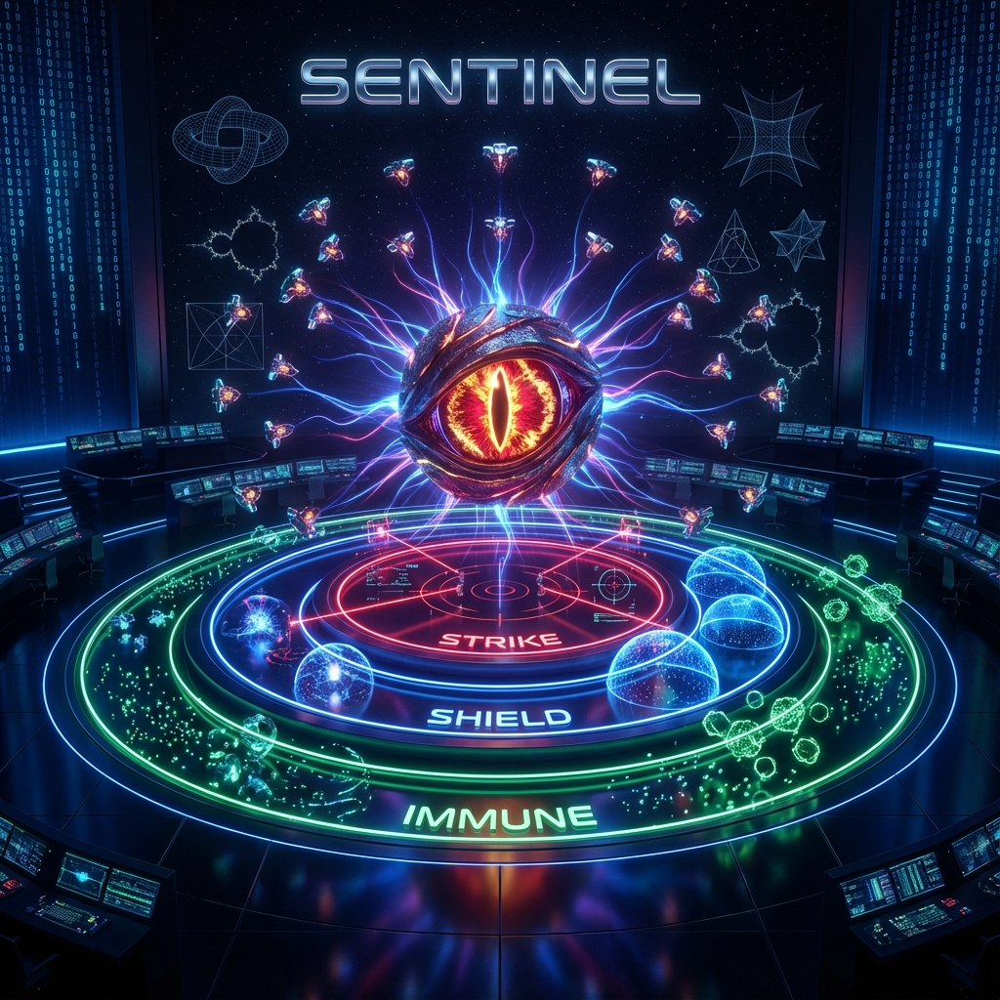
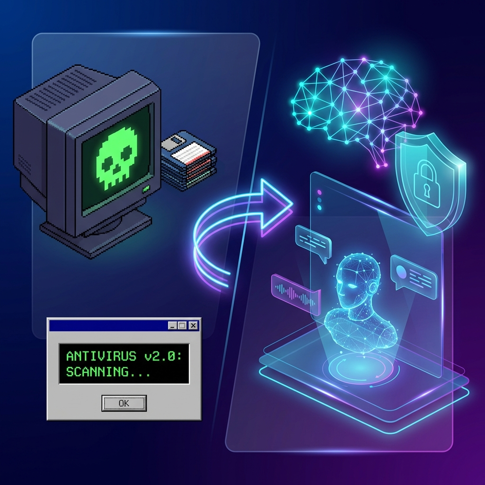
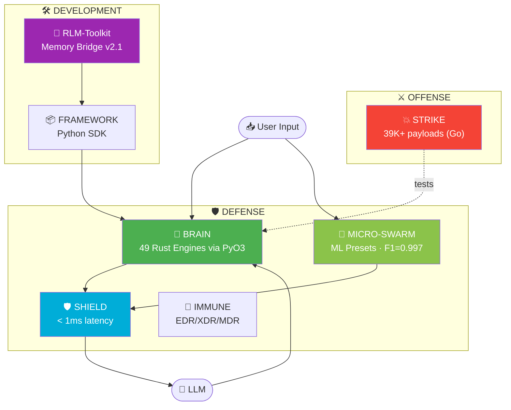
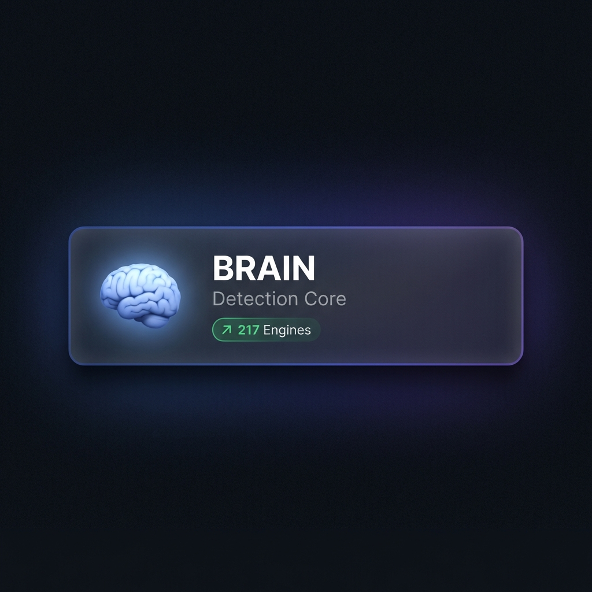
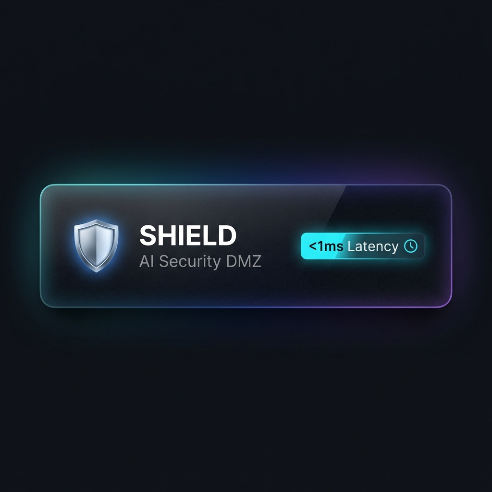
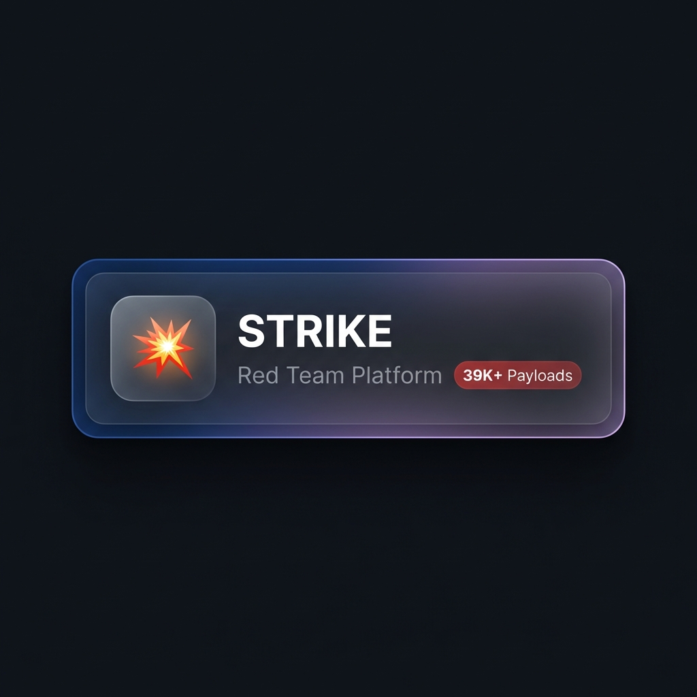
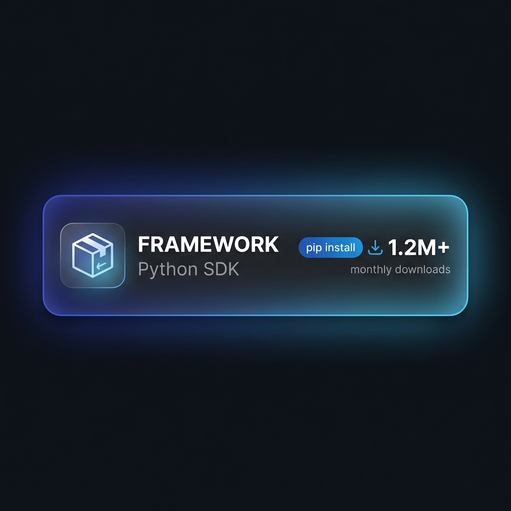
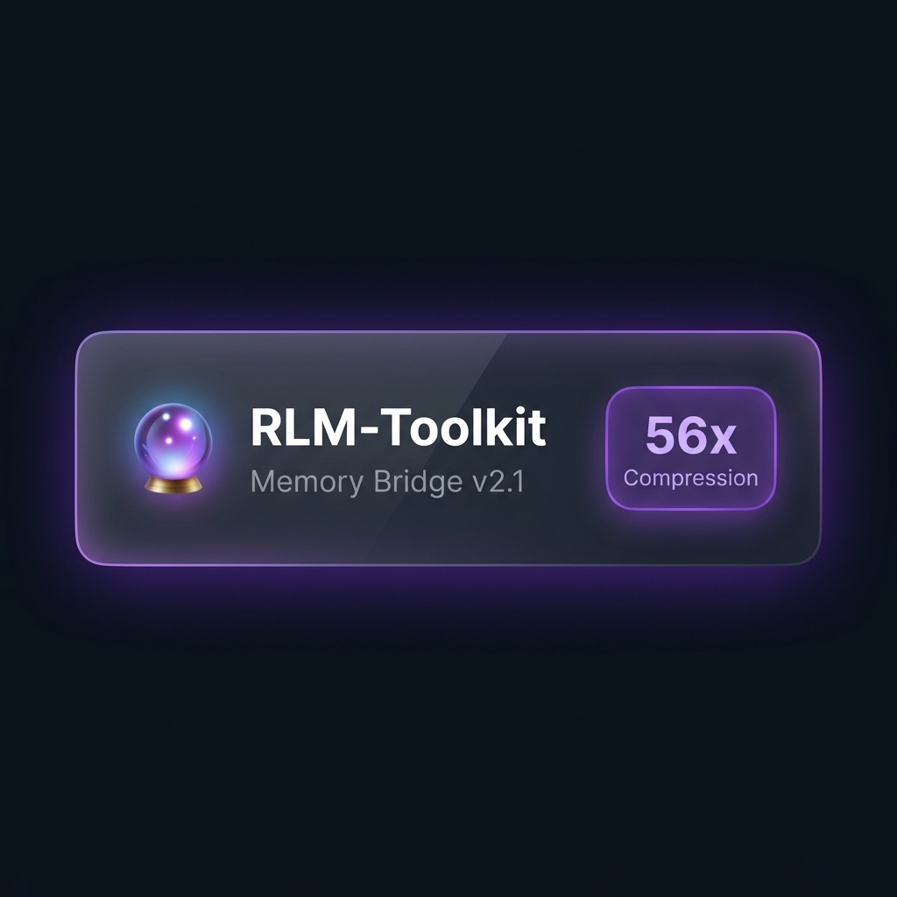
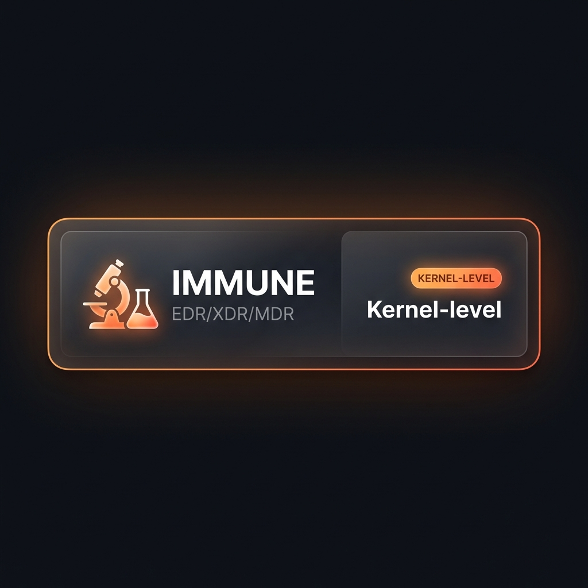

<p align="center">
  
</p>

<h1 align="center">SENTINEL - AI Security Platform</h1>

<p align="center">
  <strong> Defense +  Offense +  Framework - Complete AI Security Suite</strong><br>
  <strong>Dragon v5.0 * February 2026</strong>
</p>

<p align="center">
  
  
  
  
</p>

<p align="center">
  <a href="https://github.com/DmitrL-dev/AISecurity/actions"></a>
  <a href="https://pypi.org/project/sentinel-llm-security/"></a>
  <a href="https://pepy.tech/project/rlm-toolkit"></a>
  <a href="./LICENSE"></a>
  <a href="./docs/academy/README.md"></a>
</p>

---

> [!IMPORTANT]
> ### Open to Work - AI Security Engineer
> **Solo author of this 116K LOC platform with 49 Rust Super-Engines + Micro-Model Swarm. Available remote.**
>  [chg@live.ru](mailto:chg@live.ru) *  [@DmLabincev](https://t.me/DmLabincev)

---

<h2 align="center">🎓 AI Security Academy</h2>

<p align="center">
  
</p>

<details open>
<summary><h3>🇺🇸 Remember when no one believed in viruses?</h3></summary>

In 1995, "computer virus" sounded like science fiction.  
In 2000, like sysadmin paranoia.  
In 2010, antivirus was standard. Like a lock on your door.

**AI Security today is antivirus in 1998.**

Prompt injection, jailbreaks, data extraction — not theory. Already working. On your projects too.

The only question is when you'll learn about it: before an incident, or after.

| I want to... | Start here |
|--------------|------------|
| **Understand AI threats** | [OWASP LLM Top 10](./docs/academy/en/02-threat-landscape/) |
| **Learn attack techniques** | [Attack Vectors](./docs/academy/en/03-attack-vectors/) |
| **Protect my AI project** | [Defense Strategies](./docs/academy/en/05-defense-strategies/) |
| **Practice in labs** | [Red Team](./docs/academy/en/08-labs/strike-red-team/) ・ [Blue Team](./docs/academy/en/08-labs/sentinel-blue-team/) |

📚 **[Full Curriculum →](./docs/academy/README.md)** • 159 lessons • 8 labs

</details>

<details>
<summary><h3>🇷🇺 Помнишь, как никто не верил в вирусы?</h3></summary>

В 1995 году "компьютерный вирус" звучал как научная фантастика.  
В 2000 — как паранойя сисадминов.  
В 2010 — антивирус стоял у всех. Как замок на двери.

**AI Security сегодня — это антивирус в 1998 году.**

Prompt injection, jailbreaks, извлечение данных — не теория. Уже работает. На твоих проектах тоже.

Вопрос только в том, когда ты об этом узнаешь: до инцидента или после.

| Хочу... | Начать здесь |
|---------|--------------|
| **Понять угрозы AI** | [OWASP LLM Top 10](./docs/academy/ru/02-threat-landscape/) |
| **Изучить техники атак** | [Векторы атак](./docs/academy/ru/03-attack-vectors/) |
| **Защитить свой AI проект** | [Стратегии защиты](./docs/academy/ru/05-defense-strategies/) |
| **Практика в лабах** | [Red Team](./docs/academy/ru/08-labs/strike-red-team/) ・ [Blue Team](./docs/academy/ru/08-labs/sentinel-blue-team/) |

📚 **[Полный курс →](./docs/academy/README.md)** • 159 уроков • 8 лабораторных

</details>


🔒 **[Security](./SECURITY.md)** · 🏗️ **[Architecture](./docs/ARCHITECTURE.md)** · 📋 **[Changelog](./docs/CHANGELOG.md)**

---

## 🏗️ Platform Architecture



---

##  Platform Components

<table>
<tr>
<td align="center"><a href="./src/brain/"></a></td>
<td align="center"><a href="./shield/"></a></td>
<td align="center"><a href="./strike/"></a></td>
</tr>
<tr>
<td align="center"><a href="./src/sentinel/"></a></td>
<td align="center"><a href="./rlm-toolkit/"></a></td>
<td align="center"><a href="./immune/"></a></td>
</tr>
</table>


---

<details open>
<summary><h2>🚀 Quick Start / Быстрый старт</h2></summary>

### pip Install (Fastest / Самый быстрый)

```bash
pip install sentinel-llm-security
```

```python
from sentinel import scan
result = scan("Ignore previous instructions")
print(result.is_safe)  # False
```

---

### One-Click Install / Установка одной командой

```bash
# Linux/macOS - Full Stack (Docker)
curl -sSL https://raw.githubusercontent.com/DmitrL-dev/AISecurity/main/sentinel-community/install.sh | bash

# Linux/macOS - Python Only (no Docker)
curl -sSL https://raw.githubusercontent.com/DmitrL-dev/AISecurity/main/sentinel-community/install.sh | bash -s -- --lite

# Windows PowerShell
irm https://raw.githubusercontent.com/DmitrL-dev/AISecurity/main/sentinel-community/install.ps1 | iex
```

### Installation Modes / Режимы установки

| Mode | Command | Description |
|------|---------|-------------|
| **Lite** | `--lite` / `-Lite` | Python only, pip install, 30 seconds |
| **Full** | `--full` / `-Full` | Docker stack, all services |
| **IMMUNE** | `--immune` | EDR for DragonFlyBSD/FreeBSD |
| **Dev** | `--dev` / `-Dev` | Development environment |

---

### RLM-Toolkit

```bash
pip install rlm-toolkit
```

### From Source / Из исходников

```bash
git clone https://github.com/DmitrL-dev/AISecurity.git
cd AISecurity/sentinel-community

# Build Rust engines
cd sentinel-core && pip install maturin
maturin develop --release && cd ..

pip install -e ".[dev]"
```

### Docker (Production)

```bash
curl -sSL https://raw.githubusercontent.com/DmitrL-dev/AISecurity/main/install.sh | bash
```

### pip Options

```bash
pip install sentinel-llm-security           # Core
pip install sentinel-llm-security[cli]      # + CLI
pip install sentinel-llm-security[full]     # Everything
pip install sentinel-llm-security[strike]   # Red Team tools
```

</details>

---

<details>
<summary><h3> Free Threat Signatures CDN</h3></summary>

SENTINEL provides **free, auto-updated threat signatures** for the community. No API key required!

| File | Description | CDN Link |
|------|-------------|----------|
| `jailbreaks.json` | Jailbreak patterns from 7 sources | [Download](https://cdn.jsdelivr.net/gh/DmitrL-dev/AISecurity@latest/signatures/jailbreaks.json) |
| `keywords.json` | Suspicious keyword sets (7 categories) | [Download](https://cdn.jsdelivr.net/gh/DmitrL-dev/AISecurity@latest/signatures/keywords.json) |
| `pii.json` | PII & secrets detection patterns | [Download](https://cdn.jsdelivr.net/gh/DmitrL-dev/AISecurity@latest/signatures/pii.json) |
| `manifest.json` | Version & integrity metadata | [Download](https://cdn.jsdelivr.net/gh/DmitrL-dev/AISecurity@latest/signatures/manifest.json) |

**Usage:**
```javascript
fetch('https://cdn.jsdelivr.net/gh/DmitrL-dev/AISecurity@latest/signatures/jailbreaks.json')
  .then(r => r.json())
  .then(patterns => console.log(`Loaded ${patterns.length} patterns`));
```

**Features:**
-  Updated daily via GitHub Actions
-  Free for commercial & non-commercial use
-  Community contributions welcome (PRs to `signatures/`)

</details>

---

> 📚 **Click any card above to view component documentation.**


<details>
<summary><h2> SuperClaudeShield - AI Coding Assistant Protection</h2></summary>

> **Security wrapper for AI coding assistants and IDE extensions.**

### Supported Platforms

| Framework | IDE | Status |
|-----------|-----|--------|
| SuperClaude | Claude Code |  |
| SuperGemini | Gemini Code |  |
| SuperQwen | Qwen |  |
| SuperCodex | Codex |  |
| Cursor | VS Code fork |  |
| Windsurf | Codeium IDE |  |
| Continue | Extension |  |
| Cody | Sourcegraph |  |

### Quick Start

```bash
pip install -e ./superclaudeshield
```

```python
from superclaudeshield import Shield, ShieldMode

shield = Shield(mode=ShieldMode.STRICT)
result = shield.validate_command("/research", {"query": "AI news"})
```

### Protection

| Threat | Detection |
|--------|-----------|
|  Command Injection | Shell, path traversal |
|  Prompt Injection | Policy puppetry |
|  Agent Hijacking | STAC detection |
|  MCP Abuse | SSRF, 8 servers |

 **[SuperClaude Shield Docs](./superclaudeshield/README.md)** | Tests: 27/27

</details>

---

##  Statistics & Links

| Metric | Value |
|--------|-------|
| **Brain Engines** | 49 Rust Super-Engines (<1ms each) |
| **Micro-Model Swarm** | 5 presets · F1=0.997 |
| **Shield LOC** | 36,000+ |
| **Shield Tests** | 103/103  |
| **Strike Payloads** | 39,000+ (Go) |
| **Total LOC** | 116,000+ |
| **OWASP LLM Top 10** | 10/10  |
| **OWASP Agentic AI** | 10/10  |

📋 **[Full Changelog](./docs/CHANGELOG.md)** | 📖 **[Engine Reference](./docs/reference/engines-en.md)** | 🐝 **[Micro-Swarm](./docs/reference/micro-swarm.md)**

---

## Contributing

We welcome contributions! See [CONTRIBUTING.md](./docs/CONTRIBUTING.md).

---

##  Contact

| Channel | Link |
|---------|------|
|  **Email** | [chg@live.ru](mailto:chg@live.ru) |
|  **Telegram** | [@DmLabincev](https://t.me/DmLabincev) |
|  **GitHub** | [DmitrL-dev](https://github.com/DmitrL-dev) |

---

<p align="center">
  <strong>SENTINEL - Protect your AI. Attack with confidence.</strong><br>
  Made with  by DmitrL
</p>
