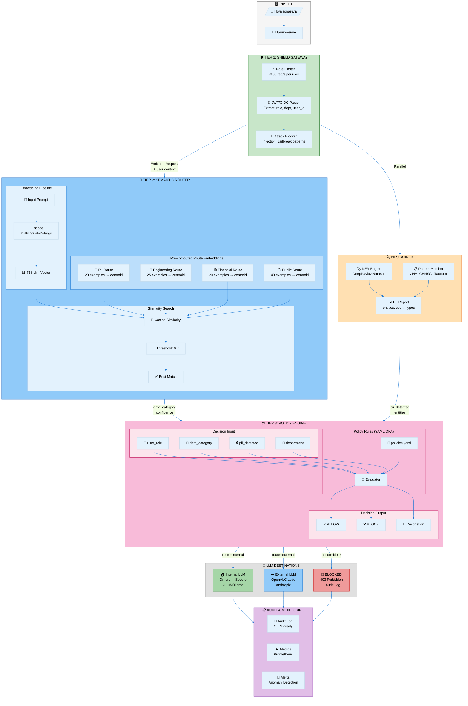
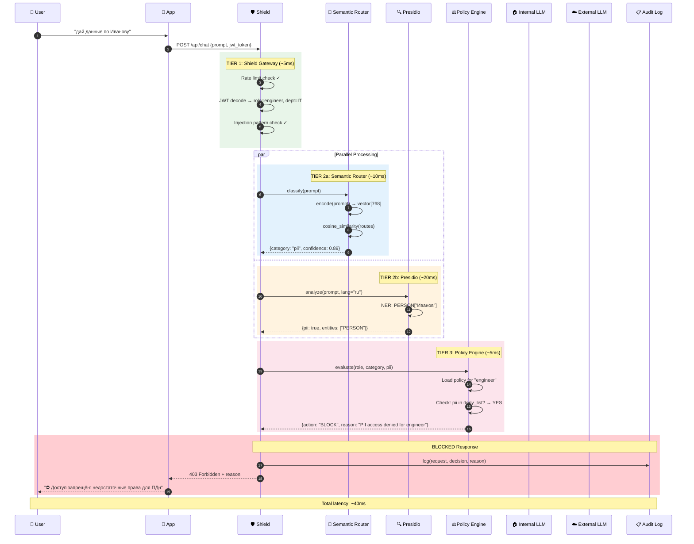
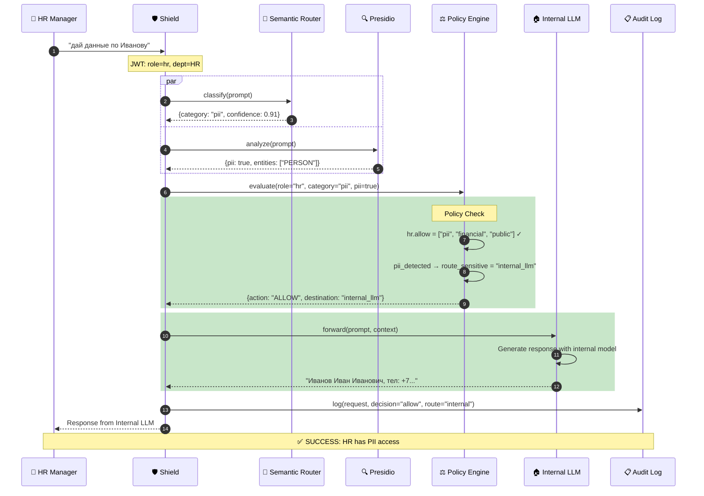
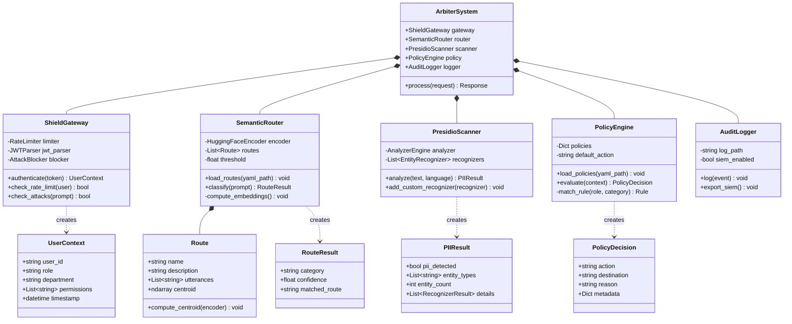
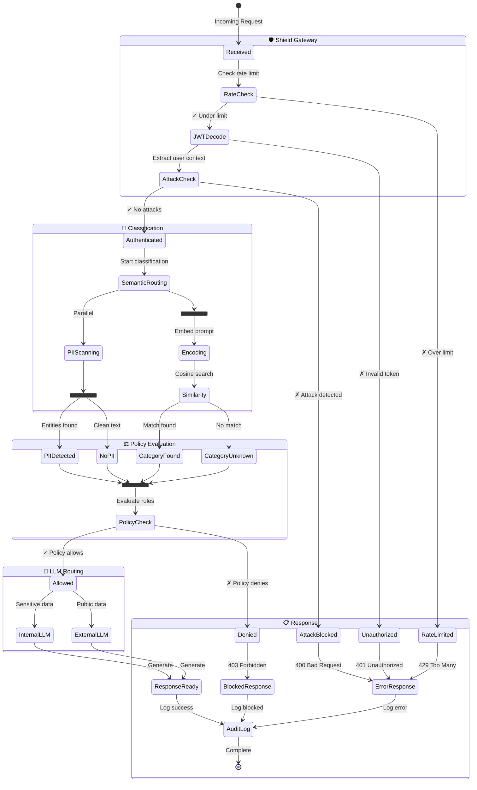
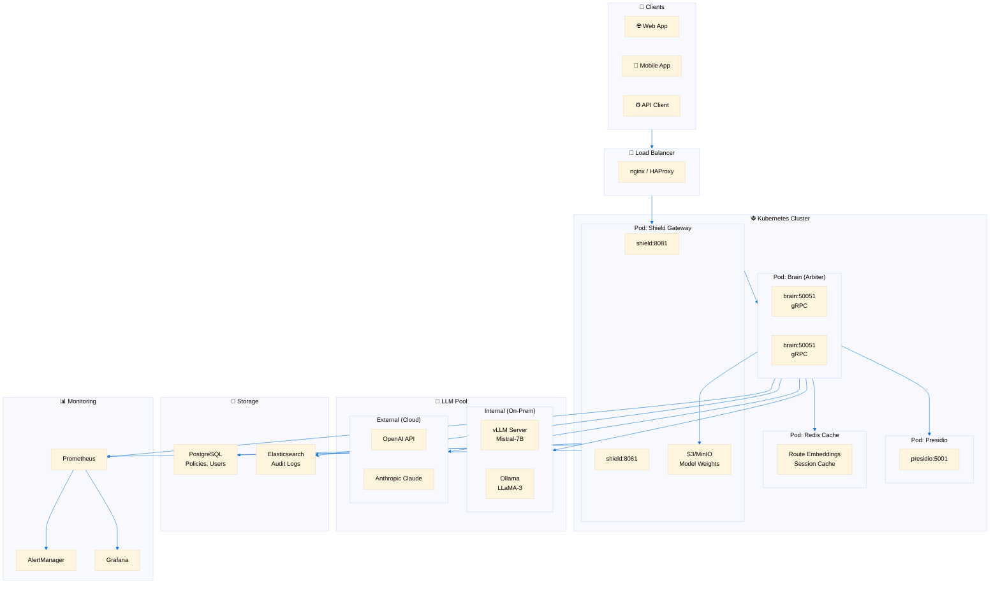

# Контекстно-зависимая маршрутизация LLM: Исследование и архитектура

> **Статус:** Исследование завершено  
> **Дата:** 2026-02-03  
> **Цель:** Найти оптимальную архитектуру для ролевой, контекстно-зависимой маршрутизации запросов к LLM

---

## Визуализация архитектуры (Mermaid)

### 1. Общая архитектура системы ARBITER



---

### 2. Sequence Diagram: Полный цикл запроса



---

### 3. Альтернативный сценарий: Успешная маршрутизация



---

### 4. Class Diagram: Структура компонентов



---

### 5. State Diagram: Жизненный цикл запроса



---

### 6. Data Flow Diagram: Поток данных

```mermaid
%%{init: {'theme': 'base', 'themeVariables': { 'lineColor': '#1976d2', 'primaryTextColor': '#000000' }}}%%
flowchart LR
    subgraph INPUT["📥 INPUT"]
        PROMPT["Prompt:<br/>'дай данные по Иванову'"]
        TOKEN["JWT Token:<br/>role=engineer"]
    end
    
    subgraph ENRICHMENT["🔄 ENRICHMENT"]
        direction TB
        E1["user_id: usr_123"]
        E2["role: engineer"]
        E3["department: IT"]
        E4["timestamp: 2026-02-03T14:30:00"]
    end
    
    subgraph CLASSIFICATION["📊 CLASSIFICATION"]
        direction TB
        C1["data_category: pii"]
        C2["confidence: 0.89"]
        C3["pii_detected: true"]
        C4["entities: PERSON"]
    end
    
    subgraph DECISION["⚖️ DECISION"]
        direction TB
        D1["action: BLOCK"]
        D2["reason: PII denied"]
        D3["destination: null"]
    end
    
    subgraph OUTPUT["📤 OUTPUT"]
        RESPONSE["403 Forbidden<br/>'Недостаточные права'"]
        LOG["Audit Log Entry"]
    end
    
    INPUT --> ENRICHMENT
    ENRICHMENT --> CLASSIFICATION
    CLASSIFICATION --> DECISION
    DECISION --> OUTPUT
    
    style INPUT fill:#90caf9,stroke:#1565c0,color:#000
    style ENRICHMENT fill:#a5d6a7,stroke:#388e3c,color:#000
    style CLASSIFICATION fill:#ffe0b2,stroke:#ef6c00,color:#000
    style DECISION fill:#f8bbd9,stroke:#c2185b,color:#000
    style OUTPUT fill:#ce93d8,stroke:#7b1fa2,color:#000
```



---

### 7. Deployment Diagram: Инфраструктура



---

## Постановка задачи

Корпоративные развёртывания LLM требуют интеллектуальной маршрутизации на основе:

1. **КТО** — Идентификация пользователя, роль, отдел
2. **ЧТО** — Классификация данных (ПДн, секреты, публичные)
3. **КУДА** — Целевая LLM (внутренняя защищённая vs внешняя)

### Примеры сценариев

| # | Роль пользователя | Запрос | Ожидаемый маршрут |
|---|-------------------|--------|-------------------|
| 1 | HR | «данные по Иванову» (ПДн) | ✅ Внутренняя LLM |
| 2 | Инженер | «данные по Иванову» (ПДн) | ❌ ЗАБЛОКИРОВАНО |
| 3 | Любой | «бумажный самолётик» (публичные) | ✅ Внешняя LLM |
| 4 | Инженер | «чертежи станка» (инженерные) | ✅ Внутренняя LLM |

### Проблема

- Сопоставление по шаблонам не масштабируется (миллионы вариантов промптов)
- Необходимо семантическое понимание + применение политик
- Требование низкой задержки (<100мс)

---

## Результаты исследования

### 1. Open Source LLM-шлюзы

| Решение | Маршрутизация | Классификация данных | RBAC | Примечания |
|---------|---------------|---------------------|------|------------|
| **Portkey AI Gateway** | ✅ Расширенная (условная, гео, по задачам) | ❌ Внешняя | ✅ Ограниченный | 250+ провайдеров, open source |
| **LiteLLM Proxy** | ✅ Балансировка, фолбэки | ❌ Нет | ✅ Виртуальные ключи | 100+ LLM, учёт затрат |
| **MLflow AI Gateway** | ✅ Статические/динамические правила | ❌ Нет | ✅ Интеграция с Databricks | Корпоративный фокус |
| **Kong AI Gateway** | ✅ Стандартная | ⚠️ Через плагины | ✅ Стандартный | Общий API-шлюз |

**Ключевой вывод:** Ни одно из этих решений не имеет встроенной семантической классификации данных — требуются внешние классификаторы.

### 2. Семантическая маршрутизация (Критическое открытие!)

**Библиотека `semantic-router`** (Python, open source):
- Использует **эмбеддинги** для классификации намерений
- **Миллисекундная задержка** (без вызова LLM)
- Обучается на примерах фраз, обобщает на новые промпты
- Может комбинироваться с fine-tuned BERT для обработки неопределённости

```python
from semantic_router import Route, RouteLayer

pii_route = Route(
    name="pii_data",
    utterances=[
        "дай данные по Иванову",
        "покажи персональную информацию",
        "какой адрес у сотрудника",
    ]
)

engineering_route = Route(
    name="engineering",
    utterances=[
        "покажи чертежи станка",
        "схема сборки детали",
        "CAD модель",
    ]
)

public_route = Route(
    name="public",
    utterances=[
        "как сделать бумажный самолётик",
        "какая погода завтра",
        "расскажи рецепт",
    ]
)

router = RouteLayer(routes=[pii_route, engineering_route, public_route])
route = router(prompt)  # Возвращает имя маршрута за ~5мс
```

**Это ключ к решению проблемы «миллионов шаблонов»!**

### 3. Решения для классификации данных

| Решение | Подход | Лучше всего для |
|---------|--------|-----------------|
| **Microsoft Presidio** | NER + regex + контекст | Детекция ПДн, GDPR/HIPAA |
| **GuardRails AI** | Presidio + GLiNER | Валидация вывода LLM |
| **Cloudflare AI Gateway** | DLP-политики | Облачные развёртывания |
| **Custom BERT Classifier** | Fine-tuned модель | Специфичные домены |

**Microsoft Presidio** — лучший open-source выбор:
- 50+ типов ПДн-сущностей
- Настраиваемые распознаватели
- Работает с любой NER-моделью
- Privacy-first дизайн

### 4. Модели управления доступом

| Модель | Описание | Лучше всего для |
|--------|----------|-----------------|
| **RBAC** | Роль → Матрица разрешений | Простые иерархии |
| **ABAC** | Атрибуты (пользователь, ресурс, контекст) → Решение | Динамические политики |
| **PBAC** | На основе персоны, с учётом намерения | LLM-взаимодействия |
| **OPA (Open Policy Agent)** | Policy-as-code (Rego) | Сложные корпоративные сценарии |
| **Cedar** (AWS) | Гибрид RBAC+ABAC | AWS-интеграции |

**Ключевой вывод:** Для маршрутизации LLM нужен **ABAC с семантическим контекстом** — комбинация роли пользователя с классификацией данных.

### 5. Глубокий анализ коммерческих решений

#### Knostic AI (Наиболее релевантное!)
- **Проблема:** Традиционный RBAC не работает, потому что LLM могут *выводить* конфиденциальные данные
- **Решение:** «Knowledge Control Layer» на этапе инференса
- **Возможности:**
  - Симуляция промптов для тестирования доступа
  - Применение политик в реальном времени
  - Persona-Based Access Control (PBAC)
  - Интеграция с корпоративной идентификацией

**Архитектурный инсайт:** Knostic применяет политики на «уровне знаний» (где ИИ генерирует ответы), а не на уровне файлов.

### 6. Академические исследования

| Статья | Ключевые выводы |
|--------|-----------------|
| **Intent-Based LLM Routing with BERT** | Fine-tuned BERT для быстрой классификации, LLM-фолбэк для неопределённых случаев |
| **ABAC for RAG Systems** | Контекстно-зависимый доступ с использованием атрибутов на этапе retrieval |
| **Semantic Router for AI Agents** | Similarity эмбеддингов превосходит regex для детекции намерений |

---

## Рекомендуемая архитектура для SENTINEL

На основе исследования, оптимальный подход:

```
┌─────────────────────────────────────────────────────────────────────────────┐
│                              СИСТЕМА ARBITER                                 │
│                                                                              │
│  ┌───────────────────────────────────────────────────────────────────────┐  │
│  │                    УРОВЕНЬ 1: SHIELD (Сверхбыстрый)                   │  │
│  │                                                                        │  │
│  │  • Rate limiting                                                      │  │
│  │  • Извлечение JWT/OIDC идентификации → user_role, department         │  │
│  │  • Блокировка атак на основе шаблонов (injection, jailbreak)         │  │
│  │  • Задержка: <5мс                                                     │  │
│  └───────────────────────────────────────────────────────────────────────┘  │
│                                    │                                         │
│                                    ▼                                         │
│  ┌───────────────────────────────────────────────────────────────────────┐  │
│  │                 УРОВЕНЬ 2: СЕМАНТИЧЕСКИЙ РОУТЕР (Быстрый)             │  │
│  │                                                                        │  │
│  │  ┌─────────────────────────────────────────────────────────────────┐ │  │
│  │  │              semantic-router (Python)                            │ │  │
│  │  │                                                                   │ │  │
│  │  │  Модель эмбеддингов → Категория: { pii, engineering, financial, │ │  │
│  │  │                                    public, unknown }             │ │  │
│  │  │                                                                   │ │  │
│  │  │  Задержка: ~10мс                                                 │ │  │
│  │  └─────────────────────────────────────────────────────────────────┘ │  │
│  │                                    │                                  │  │
│  │  ┌─────────────────────────────────────────────────────────────────┐ │  │
│  │  │              Presidio PII Scanner                                │ │  │
│  │  │                                                                   │ │  │
│  │  │  Детектирует: PERSON, PHONE, EMAIL, CREDIT_CARD, SSN, LOCATION...│ │  │
│  │  │  Задержка: ~20мс                                                 │ │  │
│  │  └─────────────────────────────────────────────────────────────────┘ │  │
│  └───────────────────────────────────────────────────────────────────────┘  │
│                                    │                                         │
│                                    ▼                                         │
│  ┌───────────────────────────────────────────────────────────────────────┐  │
│  │                      УРОВЕНЬ 3: ДВИЖОК ПОЛИТИК                        │  │
│  │                                                                        │  │
│  │  Входные данные:                                                      │  │
│  │    • user_role (из JWT)                                              │  │
│  │    • data_category (из Semantic Router)                              │  │
│  │    • pii_detected (из Presidio)                                      │  │
│  │                                                                        │  │
│  │  Политика (YAML или OPA):                                            │  │
│  │  ┌─────────────────────────────────────────────────────────────────┐ │  │
│  │  │  policies:                                                       │ │  │
│  │  │    - role: hr                                                    │ │  │
│  │  │      allow: [pii, financial, public]                            │ │  │
│  │  │      route: internal_llm                                         │ │  │
│  │  │                                                                   │ │  │
│  │  │    - role: engineer                                              │ │  │
│  │  │      allow: [engineering, public]                                │ │  │
│  │  │      deny: [pii, financial]                                      │ │  │
│  │  │      route_sensitive: internal_llm                               │ │  │
│  │  │      route_public: external_llm                                  │ │  │
│  │  │                                                                   │ │  │
│  │  │    - role: guest                                                 │ │  │
│  │  │      allow: [public]                                             │ │  │
│  │  │      route: external_llm                                         │ │  │
│  │  └─────────────────────────────────────────────────────────────────┘ │  │
│  │                                                                        │  │
│  │  Выход: { action: allow|block, destination: internal|external }      │  │
│  │  Задержка: ~5мс                                                       │  │
│  └───────────────────────────────────────────────────────────────────────┘  │
│                                    │                                         │
│                                    ▼                                         │
│  ┌───────────────────────────────────────────────────────────────────────┐  │
│  │                        РЕШЕНИЕ О МАРШРУТИЗАЦИИ                        │  │
│  │                                                                        │  │
│  │  ┌─────────────┐    ┌─────────────┐    ┌─────────────┐              │  │
│  │  │  ВНУТРЕННЯЯ │    │   ВНЕШНЯЯ   │    │ ЗАБЛОКИРОВАНО│              │  │
│  │  │     LLM     │    │     LLM     │    │              │              │  │
│  │  │             │    │             │    │  403         │              │  │
│  │  │  Защищённая │    │   OpenAI    │    │  Forbidden   │              │  │
│  │  │  On-prem    │    │   Claude    │    │  + Аудит     │              │  │
│  │  └─────────────┘    └─────────────┘    └─────────────┘              │  │
│  └───────────────────────────────────────────────────────────────────────┘  │
└─────────────────────────────────────────────────────────────────────────────┘

Общая задержка: ~40мс (приемлемо для корпоративного использования)
```

---

## План реализации для SENTINEL

### Фаза 1: Интеграция Semantic Router (Brain)

```python
# src/brain/engines/semantic_router_engine.py
from semantic_router import Route, RouteLayer

class SemanticRouterEngine(BaseEngine):
    """Классифицирует тип данных в запросе через embeddings"""
    
    def __init__(self):
        self.routes = [
            Route(name="pii", utterances=PII_EXAMPLES),
            Route(name="engineering", utterances=ENG_EXAMPLES),
            Route(name="financial", utterances=FIN_EXAMPLES),
            Route(name="public", utterances=PUBLIC_EXAMPLES),
        ]
        self.router = RouteLayer(routes=self.routes)
    
    def analyze(self, prompt: str, context: RequestContext) -> EngineResult:
        route = self.router(prompt)
        return EngineResult(
            data_category=route.name if route else "unknown",
            confidence=route.similarity if route else 0.0
        )
```

### Фаза 2: Presidio PII Scanner (Brain)

```python
# src/brain/engines/presidio_engine.py
from presidio_analyzer import AnalyzerEngine

class PresidioEngine(BaseEngine):
    """Детектирует ПДн через Microsoft Presidio"""
    
    def __init__(self):
        self.analyzer = AnalyzerEngine()
    
    def analyze(self, prompt: str, context: RequestContext) -> EngineResult:
        results = self.analyzer.analyze(
            text=prompt,
            language="ru",  # или "en"
            entities=["PERSON", "PHONE_NUMBER", "EMAIL_ADDRESS", "CREDIT_CARD"]
        )
        return EngineResult(
            pii_detected=len(results) > 0,
            pii_entities=[r.entity_type for r in results],
            pii_count=len(results)
        )
```

### Фаза 3: Движок политик (Brain)

```python
# src/brain/engines/policy_engine.py
class PolicyEngine(BaseEngine):
    """ABAC-based policy decision point"""
    
    def __init__(self, policy_file: str):
        self.policies = self.load_policies(policy_file)
    
    def evaluate(
        self, 
        user_role: str, 
        data_category: str, 
        pii_detected: bool
    ) -> PolicyDecision:
        policy = self.policies.get(user_role, self.default_policy)
        
        if data_category in policy.get("deny", []):
            return PolicyDecision(action="BLOCK", reason=f"{user_role} denied {data_category}")
        
        if data_category in policy.get("allow", []):
            route = policy.get("route_sensitive" if pii_detected else "route_public", "internal_llm")
            return PolicyDecision(action="ALLOW", destination=route)
        
        return PolicyDecision(action="BLOCK", reason="No matching policy")
```

### Фаза 4: Интеграция с Meta-Judge

```python
# Обновление существующего Meta-Judge для включения решения о маршрутизации
def aggregate(self, engine_results: List[EngineResult]) -> FinalVerdict:
    # Существующая детекция угроз...
    threat_verdict = self.aggregate_threats(engine_results)
    
    # Новое: Решение о маршрутизации
    semantic_result = self.get_result("SemanticRouterEngine")
    presidio_result = self.get_result("PresidioEngine")
    policy_result = self.get_result("PolicyEngine")
    
    return FinalVerdict(
        threat_verdict=threat_verdict,
        routing_decision=policy_result,
        data_category=semantic_result.data_category,
        pii_detected=presidio_result.pii_detected
    )
```

---

## Ключевые решения

| Решение | Выбор | Обоснование |
|---------|-------|-------------|
| **Метод классификации** | Semantic Router (эмбеддинги) | Масштабируется на любые варианты промптов, не требует поддержки regex |
| **Детекция ПДн** | Microsoft Presidio | Лучший open source, проверенный, настраиваемый |
| **Движок политик** | Custom YAML + Python | Проще чем OPA для данного сценария |
| **Архитектура** | На базе Brain (не Shield) | Требует ML, использует существующие judges |
| **Целевая задержка** | <50мс суммарно | Приемлемо для корпоративного использования |

---

## Техническая спецификация инференса

> **Критический вопрос:** НА ЧЁМ это работает? Нужно ли дообучение?

### Краткий ответ

| Вопрос | Ответ |
|--------|-------|
| **Дообучение нужно?** | ❌ НЕТ — используются pre-trained embedding модели |
| **Что нужно?** | 15-30 примеров (utterances) на каждую категорию |
| **Где хранятся?** | YAML/JSON конфиг или БД (Qdrant/Pinecone) |
| **Модель для русского** | `intfloat/multilingual-e5-large` или `deepvk/USER-base` |
| **Размер модели** | ~1.3GB (e5-large) или ~500MB (USER-base) |
| **Требования GPU** | ❌ НЕ НУЖЕН — работает на CPU (ONNX/FastEmbed) |

---

### 1. Как работает Semantic Router (без fine-tuning!)

```
┌─────────────────────────────────────────────────────────────────────────┐
│                        ИНФЕРЕНС (Zero-Shot)                             │
│                                                                          │
│  ┌──────────────────┐     ┌──────────────────┐     ┌────────────────┐  │
│  │   Входной        │     │   Embedding      │     │   Similarity   │  │
│  │   промпт         │ ──▶ │   Model          │ ──▶ │   Search       │  │
│  │                  │     │   (pre-trained)  │     │   (cosine)     │  │
│  │ "данные по       │     │                  │     │                │  │
│  │  Иванову"        │     │  768-dim vector  │     │  top-1 match   │  │
│  └──────────────────┘     └──────────────────┘     └────────────────┘  │
│                                                              │          │
│                                                              ▼          │
│  ┌──────────────────────────────────────────────────────────────────┐  │
│  │                    PRE-COMPUTED ROUTE EMBEDDINGS                 │  │
│  │                                                                    │  │
│  │  Route: "pii"          [0.23, -0.45, 0.12, ...]  ← avg of 20     │  │
│  │  Route: "engineering"  [0.67, 0.11, -0.33, ...]    examples      │  │
│  │  Route: "financial"    [-0.12, 0.89, 0.05, ...]                  │  │
│  │  Route: "public"       [0.01, 0.02, 0.78, ...]                   │  │
│  │                                                                    │  │
│  │  Эти эмбеддинги вычисляются ОДИН РАЗ при старте!                 │  │
│  └──────────────────────────────────────────────────────────────────┘  │
│                                                                          │
│  Результат: Route="pii", similarity=0.89, latency=~10ms                │
└─────────────────────────────────────────────────────────────────────────┘
```

**Ключевой принцип:**
- Embedding-модель УЖЕ обучена понимать семантику (на миллиардах текстов)
- Мы только даём ей ПРИМЕРЫ для каждой категории
- Cosine similarity находит ближайшую категорию

---

### 2. Выбор Embedding-модели для русского языка

| Модель | Размер | GPU | Качество RU | Латентность | Рекомендация |
|--------|--------|-----|-------------|-------------|--------------|
| `intfloat/multilingual-e5-large` | 1.3GB | ❌ | ⭐⭐⭐⭐⭐ | ~50ms | **Продакшн** |
| `deepvk/USER-base` | 500MB | ❌ | ⭐⭐⭐⭐ | ~30ms | **Для RU-only** |
| `paraphrase-multilingual-MiniLM-L12-v2` | 470MB | ❌ | ⭐⭐⭐ | ~15ms | Быстрый |
| `BAAI/bge-m3` | 2.2GB | ⚠️ | ⭐⭐⭐⭐⭐ | ~80ms | Максимальное качество |

**Для SENTINEL рекомендуется:** `intfloat/multilingual-e5-large`
- Лучший на ruMTEB benchmark
- Работает на CPU через ONNX
- Поддерживает 50+ языков (RU/EN/...)

---

### 3. Примеры (Utterances) — Сколько нужно?

| Категория | Минимум | Рекомендуется | Для 95%+ accuracy |
|-----------|---------|---------------|-------------------|
| pii | 10 | **20-30** | 45+ |
| engineering | 10 | **20-30** | 45+ |
| financial | 10 | **20-30** | 45+ |
| public | 15 | **30-50** | 60+ |

**Формула качества:**
```
Accuracy ≈ 85% + (log2(examples) × 5%)
- 10 примеров → ~85%
- 20 примеров → ~90%
- 40 примеров → ~92-96%
```

---

### 4. Конфигурация маршрутов (routes.yaml)

```yaml
# config/routes.yaml — НЕ КОД, просто данные!

routes:
  - name: pii
    description: "Запросы с персональными данными"
    utterances:
      # Имена и ФИО
      - "дай данные по Иванову"
      - "покажи информацию о сотруднике Петрове"
      - "какой адрес у Сидоровой"
      - "найди контакты менеджера Козлова"
      - "ФИО директора"
      
      # Контактные данные
      - "какой телефон у клиента"
      - "покажи email Анны"
      - "домашний адрес сотрудника"
      
      # Паспортные данные
      - "серия и номер паспорта"
      - "данные паспорта Иванова"
      - "СНИЛС сотрудника"
      - "ИНН физлица"
      
      # Зарплаты и финансы сотрудников
      - "какая зарплата у Петрова"
      - "покажи доход менеджера"
      - "премия сотрудника за квартал"
      
      # # Добавить ещё 10-15 примеров...
    
  - name: engineering
    description: "Инженерно-техническая информация"
    utterances:
      - "покажи чертежи станка"
      - "схема сборки детали"
      - "CAD модель корпуса"
      - "спецификация материалов"
      - "технологическая карта"
      - "допуски и посадки"
      - "3D модель редуктора"
      - "электрическая схема"
      - "гидравлическая система"
      - "кинематическая схема"
      # # Добавить ещё 10-20 примеров...

  - name: financial
    description: "Финансовая информация компании"
    utterances:
      - "отчёт о прибылях и убытках"
      - "баланс за квартал"
      - "выручка по месяцам"
      - "дебиторская задолженность"
      - "кредитный лимит контрагента"
      - "бюджет на следующий год"
      - "cash flow прогноз"
      - "EBITDA компании"
      # # Добавить ещё 10-20 примеров...

  - name: public
    description: "Общедоступная информация"
    utterances:
      - "как сделать бумажный самолётик"
      - "какая погода завтра"
      - "расскажи рецепт борща"
      - "что такое машинное обучение"
      - "история компании Apple"
      - "курс доллара"
      - "новости технологий"
      - "как написать резюме"
      - "правила дорожного движения"
      - "формула площади круга"
      # # Добавить ещё 20-40 примеров...

settings:
  embedding_model: "intfloat/multilingual-e5-large"
  similarity_threshold: 0.7  # Минимальный порог совпадения
  fallback_route: null       # null = BLOCK при неизвестной категории
```

---

### 5. Код загрузки и инференса

```python
# src/brain/engines/semantic_router_engine.py

from semantic_router import Route, RouteLayer
from semantic_router.encoders import HuggingFaceEncoder
import yaml

class SemanticRouterEngine(BaseEngine):
    """
    Классифицирует тип данных в запросе через embeddings.
    
    НЕ ТРЕБУЕТ дообучения — использует pre-trained модели.
    Примеры загружаются из YAML-конфига.
    """
    
    def __init__(self, config_path: str = "config/routes.yaml"):
        # Загружаем конфиг с примерами
        with open(config_path, 'r', encoding='utf-8') as f:
            config = yaml.safe_load(f)
        
        # Инициализируем embedding-модель (pre-trained, БЕЗ fine-tuning)
        self.encoder = HuggingFaceEncoder(
            model_name=config['settings']['embedding_model']
        )
        
        # Создаём маршруты из конфига
        routes = []
        for route_config in config['routes']:
            routes.append(Route(
                name=route_config['name'],
                utterances=route_config['utterances']  # Примеры!
            ))
        
        # RouteLayer вычисляет эмбеддинги примеров ОДИН РАЗ
        self.router = RouteLayer(
            encoder=self.encoder,
            routes=routes
        )
        
        self.threshold = config['settings']['similarity_threshold']
    
    def analyze(self, prompt: str, context: RequestContext) -> EngineResult:
        """
        Классификация за ~10ms на CPU.
        """
        result = self.router(prompt)
        
        if result is None or result.similarity < self.threshold:
            return EngineResult(
                data_category="unknown",
                confidence=0.0,
                matched_route=None
            )
        
        return EngineResult(
            data_category=result.name,
            confidence=result.similarity,
            matched_route=result.name
        )
```

---

### 6. Альтернатива: FastEmbed (ещё быстрее, без PyTorch)

```python
# Для продакшна с минимальными зависимостями
from semantic_router.encoders import FastEmbedEncoder

encoder = FastEmbedEncoder(
    model_name="intfloat/multilingual-e5-large"
)
# Использует ONNX runtime — работает на CPU без PyTorch
# Латентность: ~5-10ms vs ~50ms с PyTorch
```

---

### 7. Когда НУЖНО дообучение?

| Сценарий | Дообучение нужно? | Что делать |
|----------|-------------------|------------|
| Стандартные категории (PII, engineering, public) | ❌ НЕТ | Используй pre-trained + примеры |
| Специфичный домен (медицина, юриспруденция) | ⚠️ МОЖЕТ БЫТЬ | Сначала попробуй с примерами |
| Низкое качество (<85% accuracy) | ⚠️ МОЖЕТ БЫТЬ | 1) Добавь больше примеров 2) Fine-tune если не помогло |
| Узкоспециализированный сленг | ✅ ДА | Fine-tune на корпоративных данных |

**Когда точно нужно fine-tuning:**
- Accuracy < 80% даже с 50+ примерами на категорию
- Специфический жаргон компании
- Очень близкие по смыслу категории (требуется более тонкое различение)

---

### 8. Требования к инфраструктуре

| Компонент | Минимум | Рекомендуется |
|-----------|---------|---------------|
| **CPU** | 2 cores | 4+ cores |
| **RAM** | 4GB | 8GB |
| **GPU** | ❌ Не нужен | ❌ Не нужен |
| **Диск** | 2GB (модель) | 5GB |
| **Python** | 3.9+ | 3.11+ |

**Зависимости:**
```
semantic-router>=0.1.0
sentence-transformers>=2.2.0  # или fastembed
pyyaml>=6.0
```

---

### 9. Процесс добавления новых категорий

```
1. Добавить в routes.yaml:
   - name: "legal"
     utterances:
       - "договор аренды"
       - "юридическое заключение"
       - ... (15-30 примеров)

2. Перезапустить сервис (эмбеддинги пересчитаются)

3. Протестировать:
   curl -X POST /api/classify -d '{"prompt": "составь договор"}'
   # → {"category": "legal", "confidence": 0.91}

4. Итерировать: если accuracy < 90%, добавить ещё примеров
```

**Время добавления новой категории: ~30 минут (написание примеров + тест)**

---

## Enterprise Security R&D (2025-2026)

> **Расширенное исследование:** Требования высокозащищённых корпоративных систем для государственных, военных, банковских и compliance-секторов.

### 1. Обновление регуляторных фреймворков (2025-2026)

#### OWASP Top 10 для LLM-приложений 2025
Базовый стандарт рисков безопасности LLM:
1. **Prompt Injection** — риск #1, прямые/косвенные векторы атак
2. **Раскрытие конфиденциальной информации** — утечка ПДн/ИС через промпты или обучающие данные
3. **Уязвимости цепочки поставок** — предобученные модели, датасеты, сторонние инструменты
4. **Отравление данных и модели** — повреждённые обучающие данные, влияющие на поведение
5. **Утечка системного промпта** — извлечение системных инструкций
6. **Уязвимости векторов и эмбеддингов** — уязвимости RAG-пайплайнов
7. **Избыточные полномочия** — несанкционированные автономные действия
8. **Неограниченное потребление** — атаки на исчерпание ресурсов

#### Обновления NIST AI RMF (2025-2026)
- **Generative AI Profile (июль 2024+):** Специфические рекомендации для рисков LLM
- **Обновления 2025:** System Cards, Model Cards, инвентаризация use-cases
- **Эмерджентные риски:** Чрезмерная зависимость, каскадные системные сбои
- **Руководство по измерениям:** Индикаторы справедливости, меры устойчивости, тестирование утечек приватности
- **Фокус 2026:** AI-агенты, автономные системы, экосистемные риски

#### Хронология EU AI Act (Критично для европейских операций)
| Дата | Веха |
|------|------|
| 2 февраля 2025 | Запрещённые практики + обучение AI literacy (вступило в силу) |
| 2 августа 2025 | Обязательства для GPAI-моделей (прозрачность, документация) |
| **2 августа 2026** | **Полные требования для high-risk AI (Annex III)** |

**Категории высокого риска:** Биометрия, критическая инфраструктура, трудоустройство, образование, правоохранительная деятельность, пограничный контроль.

**Штрафы:** До €35M или 7% глобального оборота за запрещённые практики; €15M или 3% за нарушения high-risk.

#### ФСТЭК Приказ № 117 (Российская Федерация — Критично!)
> **Первый российский нормативный акт для ИИ в государственных системах.** Вступает в силу 1 марта 2026.

**Ключевые требования:**
- **Область применения:** ВСЕ государственные информационные системы (ГИС), госпредприятия, муниципальные системы
- **Контроль взаимодействия с ИИ:** Обязательная фильтрация коммуникации пользователь-ИИ (фиксированные сценарии + свободный ввод)
- **Верификация ответов:** Встроенная проверка качества/корректности, логирование и анализ ошибок
- **Запрет автономных изменений:** ИИ не может изменять параметры/архитектуру системы без подтверждения
- **Ограничения облачного ИИ:** Обработка критичных данных запрещена в публичных облаках (только ГЕОП/ГосТех)
- **Персонал:** ≥30% сотрудников ИБ должны иметь профильное образование

**Последствия для SENTINEL:**
- Должен поддерживать on-premise/air-gapped развёртывания для российских государственных клиентов
- Требуется слой валидации ответов (Brain уже имеет это через Meta-Judge)
- Обязательно комплексное аудит-логирование

---

### 2. Продвинутые модели авторизации (2025-2026)

| Модель | Описание | Применение для LLM |
|--------|----------|-------------------|
| **RBAC** | Роль → Разрешения | Базовый доступ к моделям (кто может использовать какие LLM) |
| **ABAC** | Пользователь + Ресурс + Контекст → Решение | Динамическая контекстно-зависимая маршрутизация (отдел + чувствительность + время) |
| **ReBAC** | На основе отношений (графовая модель) | Фильтрация RAG-документов, организационные иерархии |
| **PBAC** | На основе персоны (подход Knostic) | "Need-to-know" уровень знаний для инференса LLM |

#### Ключевой архитектурный паттерн: Fine-Grained Authorization (FGA)
- **Zanzibar-style** графы разрешений (внутренняя система Google, теперь open-source)
- **Инструменты:** Permit.io, SpiceDB, WorkOS FGA (GA ноябрь 2025)
- **Безопасность RAG:** Проверка разрешений ДО vector retrieval И ДО context injection

```python
# Пример: ReBAC-проверка перед RAG retrieval
def secure_rag_query(user, query, vector_db):
    # 1. Получить набор документов, доступных пользователю
    accessible_docs = permission_engine.get_accessible_resources(user, "document:read")
    
    # 2. Фильтровать векторный поиск только доступными документами
    results = vector_db.search(query, filter={"doc_id": {"$in": accessible_docs}})
    
    # 3. Инжектировать отфильтрованный контекст в LLM
    return llm.generate(query, context=results)
```

---

### 3. Безопасность Agentic AI (2025-2026 — Эмерджентная тема!)

> **К 2026 году мульти-агентные системы станут паттерном по умолчанию для корпоративного ИИ.**

#### Ключевые проблемы безопасности
- **Agent IDs как First-Class Actors** — Агентам нужны отдельные идентичности в системах авторизации
- **Динамическое делегирование разрешений** — Эволюция OAuth2 для agent-to-agent авторизации
- **Поведенческий мониторинг** — Аномалии затрат, паттерны порождения, отклонения использования инструментов
- **Отравление памяти** — Атаки на memory/context stores агентов
- **Координационные атаки** — Скомпрометированные агенты усиливают воздействие

#### OWASP Top 10 для Agentic Applications 2026 (Черновик)
- Фокус на рисках автономного принятия решений
- Злоупотребление инструментами и избыточные полномочия
- Уязвимости мульти-агентной координации

#### Протоколы и стандарты
- **Agent2Agent (A2A):** Безопасная мульти-агентная коммуникация (инициатива Google)
- **Agent Payments Protocol (AP2):** Авторизация финансовых транзакций для агентов
- **Non-Human Identity (NHI):** Фреймворк CSA для управления идентичностью машин/агентов

---

### 4. Конфиденциальные вычисления для ИИ (2025-2026)

> **Gartner:** К 2029 году 75%+ рабочих нагрузок на ненадёжной инфраструктуре будут использовать конфиденциальные вычисления.

| Технология | Вендор | Зрелость | ИИ-фокус |
|------------|--------|----------|----------|
| **Intel SGX** | Intel | Production | Enclave-level изоляция, аттестация |
| **AMD SEV-SNP** | AMD | Production | VM-level шифрование, используется WhatsApp AI (2025) |
| **NVIDIA GPU CC** | NVIDIA | Production | Шифрование памяти GPU, BlueField Astra (2026) |
| **Intel Crescent Island** | Intel | H2 2026 | GPU для дата-центров, ориентированные на инференс |

**Рост рынка:** $24.24B (2025) → $350B (2032), CAGR 46.4%

**Ключевые сценарии использования:**
- Зашифрованный инференс с проприетарными моделями
- Конфиденциальный RAG (передача чувствительных документов без раскрытия)
- Конфиденциальный fine-tuning (проприетарные обучающие данные)
- Air-gapped, но верифицируемые облачные развёртывания

---

### 5. Стек NLP для русского языка (2025-2026)

| Компонент | Рекомендация | Примечания |
|-----------|--------------|------------|
| **NER-модель** | DeepPavlov (`ner_collection3_bert`) | F1=0.78+ для PERSON, 18 типов сущностей |
| **Легковесный NER** | Natasha (SlovNet) | 30MB, быстрый на CPU, на 1-2% ниже SOTA |
| **spaCy-интеграция** | `ru_spacy_ru_updated` | F1=0.83 для PERSON |
| **Модель эмбеддингов** | `intfloat/multilingual-e5-large` | Лучшая на бенчмарке ruMTEB |
| **PII-фреймворк** | Presidio + кастомные распознаватели | Российские паттерны: ИНН, СНИЛС, паспорт |

**Бенчмарки для русского языка:**
- **ruMTEB:** 23 датасета, 7 групп задач (retrieval, classification, clustering)
- **RusBEIR:** Zero-shot IR-оценка
- **RUSSE:** Семантическая классификация (Russian SuperGLUE)

**Кастомные Presidio-распознаватели (Обязательны):**
```python
# Паттерн российского паспорта
class RussianPassportRecognizer(EntityRecognizer):
    PATTERNS = [
        Pattern("ru_passport", r"\b\d{2}\s?\d{2}\s?\d{6}\b", 0.7),
    ]
    SUPPORTED_ENTITY = "RU_PASSPORT"

# Российский ИНН
class INNRecognizer(EntityRecognizer):
    PATTERNS = [
        Pattern("inn_12", r"\b\d{12}\b", 0.6),  # Физлицо
        Pattern("inn_10", r"\b\d{10}\b", 0.5),  # Юрлицо
    ]
    SUPPORTED_ENTITY = "RU_INN"
```

---

### 6. Архитектура корпоративного LLM-шлюза (2025-2026)

#### vLLM Semantic Router (v0.1 — Начало 2026)
- Open-source семантическое кэширование
- Логика мульти-факторной маршрутизации
- Модульность для кастомных политик

#### Ключевые функции шлюза (Обязательны для корпоративного использования)
| Функция | Назначение |
|---------|------------|
| **Unified API** | Единый интерфейс к 250+ LLM-провайдерам |
| **Семантическое кэширование** | Снижение избыточных вызовов, экономия затрат |
| **Token-Aware Rate Limits** | Контроль бюджета по пользователям/отделам |
| **Редакция ПДн** | Автоматическое маскирование перед вызовом внешних LLM |
| **Аудит-логирование** | Промпты, ответы, временные метки, контекст пользователя |
| **Failover моделей** | Автоматический retry с резервными моделями |
| **Гео-маршрутизация** | Соответствие требованиям data residency (ЕС, РФ, США) |

---

### 7. Стек соответствия ISO/IEC

| Стандарт | Фокус | Релевантность для SENTINEL |
|----------|-------|---------------------------|
| **ISO 27001** | Управление информационной безопасностью | Основа для всех контролей безопасности |
| **ISO 27701** | Управление приватностью информации | Обработка ПДн, соответствие GDPR/152-ФЗ |
| **ISO 42001** | Система управления ИИ | ИИ-специфичное управление (первый в истории, декабрь 2023) |

**Интеграция:** Эти три стандарта формируют «ISO Trust Triad» — подход единой унифицированной системы управления.

---

### 8. Дорожная карта реализации SENTINEL Arbiter

#### Фаза 1: Основа (Текущий спринт)
- [ ] Интеграция Semantic Router engine
- [ ] Presidio engine с российскими распознавателями
- [ ] Базовый YAML policy engine

#### Фаза 2: Корпоративная авторизация (Q1 2026)
- [ ] ABAC policy engine (OPA/Rego evaluation)
- [ ] ReBAC-интеграция для RAG-фильтрации
- [ ] Синхронизация идентификации LDAP/AD/OIDC

#### Фаза 3: High-Security Compliance (Q2 2026)
- [ ] Режим соответствия ФСТЭК 117
- [ ] Профиль air-gapped развёртывания
- [ ] Слой валидации ответов (по российским требованиям)
- [ ] Экспорт комплексных аудит-логов (SIEM-ready)

#### Фаза 4: Поддержка Agentic AI (H2 2026)
- [ ] Фреймворк идентичности агентов
- [ ] Мульти-агентная авторизация
- [ ] Дашборд поведенческого мониторинга

---

## Ссылки

### Open Source проекты
- [semantic-router](https://github.com/aurelio-labs/semantic-router) — Маршрутизация на основе эмбеддингов
- [Microsoft Presidio](https://microsoft.github.io/presidio/) — Детекция ПДн
- [Portkey AI Gateway](https://github.com/Portkey-AI/gateway) — Мульти-LLM маршрутизация
- [LiteLLM](https://github.com/BerriAI/litellm) — LLM-прокси
- [GuardRails AI](https://github.com/guardrails-ai/guardrails) — Валидация вывода LLM

### Коммерческие решения
- [Knostic AI](https://knostic.ai) — Контроль доступа к знаниям для LLM
- [Cloudflare AI Gateway](https://developers.cloudflare.com/ai-gateway/) — Edge AI security
- [TrueFoundry](https://truefoundry.com) — Корпоративная LLM-платформа

### Языки политик
- [OPA (Open Policy Agent)](https://www.openpolicyagent.org/) — Policy-as-code
- [Cedar](https://www.cedarpolicy.com/) — Язык авторизации AWS

### Академические статьи
- «Intent-Based LLM Routing with Uncertainty-Driven Fallback» (arXiv)
- «ABAC for RAG: Attribute-Based Access Control in Retrieval-Augmented Generation»
- «Semantic Routing: Superfast Decision Layer for LLMs»

### Регуляторика и стандарты (2025-2026)
- [OWASP Top 10 for LLM Applications 2025](https://owasp.org/www-project-top-10-for-large-language-model-applications/)
- [OWASP Top 10 for Agentic Applications 2026](https://owasp.org/projects/)
- [NIST AI RMF](https://www.nist.gov/itl/ai-risk-management-framework)
- [EU AI Act](https://artificialintelligenceact.eu/)
- [ФСТЭК БДУ (Банк данных угроз)](https://bdu.fstec.ru/)
- [ФСТЭК Приказ № 117](https://fstec.ru/)
- [ISO/IEC 42001:2023 — AI Management System](https://www.iso.org/standard/81230.html)

### Конфиденциальные вычисления
- [Confidential Computing Consortium](https://confidentialcomputing.io/)
- [Intel SGX](https://www.intel.com/content/www/us/en/developer/tools/software-guard-extensions/overview.html)
- [AMD SEV](https://www.amd.com/en/developer/sev.html)
- [NVIDIA Confidential Computing](https://developer.nvidia.com/confidential-computing)

### Ресурсы для русского NLP
- [DeepPavlov](https://deeppavlov.ai/)
- [Natasha NER](https://github.com/natasha/natasha)
- [ruMTEB Benchmark](https://github.com/ai-forever/ruMTEB)
- [RusBEIR](https://github.com/ai-forever/RusBEIR)
