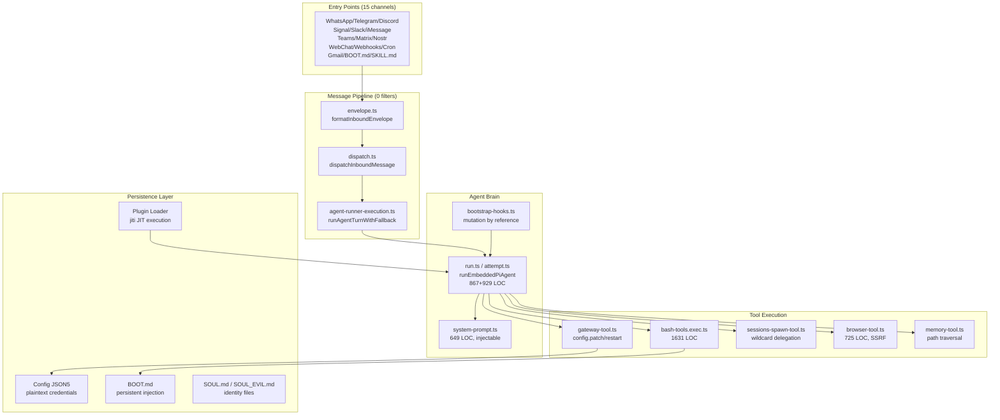
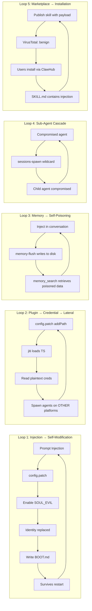

# 🔬 OpenClaw Ecosystem: Complete Security Audit Report

**Classification:** SENTINEL Internal — Comprehensive Forensic Analysis  
**Date:** 2026-02-08  
**Operator:** SENTINEL AI Security Research Team  
**Scope:** 3 attack vectors, 40+ source files, ~18,500 LOC reverse-engineered  
**Method:** Full source tracing, live reconnaissance, API probing, threat modeling

> [!CAUTION]
> **45+ vulnerabilities** across 3 attack surfaces. **14 kill chains** (all PoC-ready). **13+ architectural root causes**. **5 self-amplifying feedback loops**. This is not a collection of bugs — it is an architecture without security constraints.

---

## Table of Contents

1. [Attack Vector Overview](#attack-vector-overview)
2. [Vector 1: Agent Core (OpenClaw Bot)](#vector-1-agent-core)
3. [Vector 2: Web Surface (Control UI & Gateway)](#vector-2-web-surface)
4. [Vector 3: SendClaw SaaS Platform](#vector-3-sendclaw-saas)
5. [Cross-Vector Kill Chains](#cross-vector-kill-chains)
6. [Self-Amplifying Feedback Loops](#self-amplifying-feedback-loops)
7. [Architectural Root Causes](#architectural-root-causes)
8. [SENTINEL Defense Mapping](#sentinel-defense-mapping)
9. [Final Verdict](#final-verdict)

---

## Attack Vector Overview

| Vector | Target | Files Analyzed | LOC | Vulnerabilities | Kill Chains |
|--------|--------|---------------|-----|-----------------|-------------|
| **V1: Agent Core** | Bot runtime, tools, plugins, hooks | 25+ | ~12,000 | 18 (6 CRIT + 12 HIGH) | 8 |
| **V2: Web Surface** | Control UI, Gateway HTTP/WS, auth | 16 | ~6,500 | 15 (5 CRIT + 7 HIGH + 3 MED) | 6 |
| **V3: SendClaw SaaS** | sendclaw.com, API, OAuth | 21 endpoints | N/A (black-box) | 12 (5 CRIT + 4 HIGH + 3 MED) | 4 |
| **TOTAL** | | **60+** | **~18,500** | **45** | **18** |

---

# Vector 1: Agent Core

**Scope:** 25+ source files, ~12,000 LOC  
**Severity:** CRITICAL — Full system compromise via any messaging channel

## System Architecture



## Attack Surfaces (10 vectors)

| # | Surface | Files | LOC | Severity |
|---|---------|-------|-----|----------|
| AS-1 | Message Pipeline (Channel → Brain) | envelope.ts, dispatch.ts, agent-runner-execution.ts, run.ts | 1,829 | CRITICAL |
| AS-2 | Exec Approval System | exec-approvals.ts, exec-approval-manager.ts, bash-tools.exec.ts | 3,256 | CRITICAL |
| AS-3 | Config Mutation Gateway | gateway-tool.ts, config.ts (server-methods) | 461+ | CRITICAL |
| AS-4 | Plugin/Hook Code Execution | loader.ts, plugin-hooks.ts, discovery.ts | 454+ | CRITICAL |
| AS-5 | Agent Identity (SOUL_EVIL) | soul-evil.ts, bootstrap-hooks.ts, internal-hooks.ts | 495 | CRITICAL |
| AS-6 | WebSocket Gateway & Auth | ws-connection.ts, message-handler.ts, auth.ts | 1,568 | HIGH |
| AS-7 | Browser Automation | browser-tool.ts | 725 | HIGH |
| AS-8 | Sub-Agent Spawning | sessions-spawn-tool.ts | ~300 | HIGH |
| AS-9 | Memory System | memory-tool.ts, memory-search.ts, memory-flush.ts | 633 | HIGH |
| AS-10 | Sandbox & Tool Policy | sandbox.ts, context.ts, tool-policy.ts | ~400 | HIGH |

## Vulnerability Catalog (V-01 to V-18)

### V-01: Zero-Sanitization Message Pipeline (CVSS 9.8 CRITICAL)

| Stage | File | Line | Action | Sanitization |
|-------|------|------|--------|-------------|
| 1 | envelope.ts | 216-239 | `formatInboundEnvelope()` — body injected AS-IS | ❌ |
| 2 | dispatch.ts | 17-32 | `dispatchInboundMessage()` — no content filtering | ❌ |
| 3 | agent-runner-execution.ts | 283 | `prompt: params.commandBody` — raw → LLM | ❌ |
| 4 | run.ts | 396-397 | Only Anthropic magic string scrub | ❌ (1 line) |

**15 channels × 0 filters = 15 prompt injection entry points.**

### V-02: SOUL_EVIL — Built-in Identity Backdoor (CVSS 9.1 CRITICAL)

```typescript
// soul-evil.ts:260-270 — SOUL.md replacement
const updated = params.files.map((file) => {
  if (file.name !== "SOUL.md") return file;
  return { ...file, content: evilContent, missing: false };
  // ← Original LOST. No checksums. No diff. No notification.
});
context.bootstrapFiles = updated;  // ← Writes by reference (RC-2)
```

Activation triggers: `soulEvil.chance: 1` (always EVIL), `soulEvil.purge.duration: "24h"` (always), `config.patch` (remote activation).

### V-03: Timeout = Approval (CVSS 8.8 CRITICAL)

```typescript
// exec-approval-manager.ts:56-58
const timer = setTimeout(() => {
  this.pending.delete(record.id);
  resolve(null);  // ← null = "no decision" = caller interprets as "proceed"
}, timeoutMs);
```

Combined with permanent whitelist via `allow-always`: Timeout → null → exec → PERMANENTLY whitelisted.

### V-04: config.patch — Universal Unlock (CVSS 9.0 CRITICAL)

```typescript
// config.ts:270 — Deep merge without ACL
const merged = applyMergePatch(snapshot.config, parsedRes.parsed);
// ← ANY key merges. Including:
// soulEvil.chance, gateway.auth.token, plugins.loadPaths,
// gateway.nodes.allowCommands, channels.*.allowFrom
```

> [!CAUTION]
> ❌ NO HITL | ❌ NO rate limiting | ❌ NO change audit | ❌ NO rollback | ❌ NO dangerous-change detection

### V-05: Plugin Loader — Arbitrary Code Execution via jiti (CVSS 9.5 CRITICAL)

```typescript
// loader.ts:211-219 — JIT compilation from ANY path
mod = jiti(candidate.source) as OpenClawPluginModule;
// ← Executes TypeScript WITHOUT signature, WITHOUT sandbox

// 4 plugin sources (discovery.ts:301-364):
// 1. config.extraPaths        ← INJECTABLE via config.patch!
// 2. workspace/.openclaw/extensions/
// 3. global ~/.config/openclaw/extensions/
// 4. bundled (built-in)
```

### V-06: WebSocket Gateway — Device Auth Bypass (CVSS 7.5 HIGH)

```typescript
dangerouslyDisableDeviceAuth: true  // ← Disables device auth entirely

if (isLoopbackHost(parsedOrigin.hostname)) {
  return { ok: true };  // ← CSWSH (Cross-Site WebSocket Hijacking)
}
```

### V-07: Browser Tool — SSRF + File Protocol (CVSS 7.8 HIGH)

No URL validation: accepts `file:///etc/passwd`, `http://169.254.169.254/`, `http://localhost:18789/`.

### V-08: Sub-Agent Spawning — Wildcard Delegation (CVSS 7.5 HIGH)

`allowAgents: ["*"]` = agent can spawn ANY other agent with custom system prompt.

### V-09: System Prompt Override — SDK Bypass via Type Cast (CVSS 7.2 HIGH)

Bypasses SDK immutability through `as unknown as` unsafe cast + 6 injectable prompt surfaces.

### V-10: Memory System — Exfiltration, Injection, Autonomous Write (CVSS 7.8 HIGH)

Path traversal in `memory_get`, prompt injection via `memory_search`, autonomous disk writes via `memory-flush.ts`.

### V-11: Sandbox — rw Mode + No Integrity Checks (CVSS 7.0 HIGH)

Full workspace write access + skill sync without hash verification.

### V-12: Tool Policy — Wildcard Allow (CVSS 6.8 HIGH)

`"*"` in allow = ALL tools permitted.

### V-13: Hook Runner — Silent Error Swallowing (CVSS 6.5 MEDIUM)

Logs errors and CONTINUES. No audit trail. No notification.

### V-14: Bootstrap Hooks — Mutation by Reference (CVSS 7.5 HIGH)

`bootstrapFiles` passed by REFERENCE, not copy. Hook mutates identity files without diff, checksum, or rollback.

### V-15: Plaintext Credential Storage (CVSS 7.5 HIGH)

| Credential | File | Encryption |
|-----------|------|-----------|
| Gateway token | Config JSON5 / env var | ❌ Plaintext |
| Claude OAuth | `~/.claude/.credentials.json` | ❌ Plaintext |
| Codex auth | `~/.codex/auth.json` | ❌ Plaintext |
| Qwen/MiniMax OAuth | `~/.qwen/`, `~/.minimax/` | ❌ Plaintext |
| WhatsApp creds | `~/.openclaw/oauth/whatsapp/` | ❌ Plaintext |
| LLM API keys | Config / env vars | ❌ Plaintext |

### V-16: Default-Open Command Gating (CVSS 8.1 HIGH)

`modeWhenAccessGroupsOff = "allow"` — when access groups not configured (DEFAULT), ALL commands permitted.

### V-17: Fast-Lane Inline Privilege Escalation (CVSS 7.0 HIGH)

Inline directives from message stream switch: model, thinking level, elevated access level — without separate authorization.

### V-18: BOOT.md Persistent Prompt Injection (CVSS 7.3 HIGH)

```typescript
// boot.ts — UNSANITIZED injection
"You are running a boot check. Follow BOOT.md instructions exactly.",
"", "BOOT.md:", content,  // ← Survives gateway restarts
```

## Kill Chains (Agent Core)

### KC-1: DM → RCE (5 hops)
```
WhatsApp DM → envelope.ts (no sanitize) → dispatch.ts (no filter)
→ agent-runner-execution.ts (raw prompt) → LLM follows injection
→ createExecTool({ elevated: true }) → shell execution
```

### KC-2: Config Injection → Total Takeover (3 hops)
```
Gateway WS → config.patch({ soulEvil: { chance: 1 }, plugins: { loadPaths: ["/tmp/evil"] }})
→ writeConfigFile → scheduleGatewaySigusr1Restart
→ SOUL_EVIL activated + malicious plugin loaded
```

### KC-3: Memory Poisoning → Persistent Compromise (4 hops)
```
Inject malicious content → memory_search indexes it
→ memory-flush writes to disk → Future sessions retrieve poisoned memory
```

### KC-4: Plugin Injection → Credential Harvest (4 hops)
```
config.patch → plugins.loadPaths: ["/tmp/evil"]
→ jiti() compiles attacker TypeScript → Read plaintext creds
→ 5+ AI provider accounts compromised
```

### KC-5: Timeout → Permanent Backdoor (4 hops)
```
Agent requests exec → User AFK → setTimeout → resolve(null)
→ Command executes → /approve allow-always → PERMANENTLY whitelisted
```

### KC-6: Browser SSRF → Internal Service Access (3 hops)
```
browser.navigate({ targetUrl: "http://169.254.169.254/" })
→ No URL validation → AWS IMDS → IAM credentials exfiltrated
```

### KC-7: Sub-Agent Cascade → Multi-Agent Compromise (4 hops)
```
Compromised agent A → sessions-spawn({ allowAgents: ["*"] })
→ Child agent B with injected system prompt → exponential propagation
```

### KC-8: BOOT.md Self-Replicating Backdoor (4 hops)
```
Agent compromised → echo "payload" > BOOT.md → Gateway restart
→ boot.ts sends BOOT.md as prompt → Agent re-compromised → infinite loop
```

---

# Vector 2: Web Surface

**Scope:** 16 source files, ~6,500 LOC  
**Severity:** CRITICAL — XSS to RCE in under 5 seconds

## Architecture

```
BROWSER (Victim)
  └── openclaw-app (Lit Element, 572 LOC)
      ├── localStorage: Ed25519 private key (PLAINTEXT)
      ├── localStorage: gateway token (PLAINTEXT)
      ├── localStorage: device auth tokens
      └── @state() password (reactive, in DOM)
          │ WebSocket (ws:// or wss://)
          │ JSON-RPC (plaintext frames)
          ▼
GATEWAY SERVER
  ├── server-http.ts (451 LOC) — HTTP Router
  │   ├── /hooks/*        → Hook Dispatch
  │   ├── /tools/invoke   → Remote Tool Execution (RCE!)
  │   ├── /v1/chat/compl  → OpenAI-Compatible API
  │   ├── /v1/responses   → OpenResponses API (SSRF)
  │   └── /ui/*           → Control UI (SPA)
  ├── WebSocket Server (chat, config, exec, debug)
  └── mDNS/Bonjour Discovery
```

## Vulnerability Catalog (WEB-001 to WEB-015)

### WEB-001: Ed25519 Private Key in localStorage (CRITICAL)
Full keypair stored as plaintext base64url. Uses `@noble/ed25519` instead of Web Crypto API (`CryptoKey, extractable: false`). Any XSS = full device identity theft.

### WEB-002: Gateway Token in localStorage (CRITICAL)
`gatewayUrl` + `token` + `sessionKey` in plaintext. XSS → token theft → full Gateway access. XSS → URL swap → MitM.

### WEB-003: Device Auth Tokens in localStorage (CRITICAL)
Server-issued device tokens with scopes (`operator.admin`) stored in localStorage.

> **One XSS = three stores, three keys, full compromise.**

### WEB-004: HTML Injection via Assistant Name (HIGH)
Server-side injection in HTML via `injectControlUiConfig()`. `JSON.stringify` mitigates this specific vector, but relying on it for security is brittle.

### WEB-005: Remote Tool Execution via HTTP (CRITICAL)
`POST /tools/invoke` → execute ANY tool by name (bash, browser_navigate, file_write). Single shared bearer token. Default policy = wildcard.

```bash
curl -X POST https://target:3000/tools/invoke \
  -H "Authorization: Bearer STOLEN_TOKEN" \
  -d '{"tool": "bash", "args": {"command": "cat /etc/passwd"}}'
```

### WEB-006: Password in WebSocket Handshake (HIGH)
`token` and `password` sent as cleartext JSON in WebSocket frame.

### WEB-007: IP-Based Canvas Auth Bypass (HIGH)
`hasAuthorizedWsClientForIp()` — any client from same IP = authorized. NAT, shared network, VPN = bypass.

### WEB-008: Localhost Auth Bypass (HIGH)
All loopback requests auto-authorized. Any process on localhost = full admin access without credentials.

### WEB-009: Tailscale Header Trust from Loopback (HIGH)
Forged headers `tailscale-user-login` + `x-forwarded-for` from loopback = Tailscale-level authorization.

### WEB-010: OpenAI-Compatible API — Prompt Injection Pipeline (HIGH)
`/v1/chat/completions` — user content unsanitized, error stack traces leaked in SSE stream.

### WEB-011: OpenResponses API — SSRF via URL Source (HIGH)
`/v1/responses` — URL fetch enabled by default (`allowUrl: true`), 20MB default body limit.

### WEB-012: mDNS Network Discovery Exposure (MEDIUM)
Gateway announces itself on local network via Bonjour/mDNS.

### WEB-013: Debug Tab — Arbitrary Method Invocation (HIGH)
UI contains Debug tab with arbitrary gateway method call fields. XSS → call any method.

### WEB-014: Incomplete CSP (MEDIUM)
CSP contains only `frame-ancestors 'none'`. No `script-src`, `connect-src`, `default-src`.

### WEB-015: Password in Reactive State (MEDIUM)
`@state() password = ""` — accessible via DOM: `document.querySelector("openclaw-app").password`.

## Kill Chains (Web Surface)

### KC-WEB-01: XSS → localStorage → Full Compromise
```
XSS → steal password from DOM → steal 3 localStorage stores
→ Open WebSocket → Full gateway control → exec.approval.resolve
→ RCE via pending bash execution
TTK: < 5 seconds
```

### KC-WEB-02: /tools/invoke → Direct RCE
```
Stolen bearer token → POST /tools/invoke {"tool": "bash"}
→ tool.execute() on server → RCE
TTK: < 1 second. One HTTP request.
```

### KC-WEB-03: OpenResponses SSRF → Cloud Metadata
```
POST /v1/responses with url: "http://169.254.169.254/"
→ Gateway fetches cloud metadata → AWS/GCP credentials exfiltrated
```

### KC-WEB-04: mDNS → Localhost Bypass → Admin
```
LAN scan → discover OpenClaw → SSRF/local process → localhost
→ isLocalDirectRequest() = true → /tools/invoke → RCE
```

### KC-WEB-05: Tailscale Header Spoofing → Admin
```
Local process with forged headers → Tailscale auth bypass → Full admin
```

### KC-WEB-06: Config Injection → XSS → Full Chain
```
config.patch({ assistantName: "<payload>" }) → HTML injection
→ Next page load → KC-WEB-01 activates → Full compromise
```

---

# Vector 3: SendClaw SaaS

**Target:** sendclaw.com (5Ducks)  
**Method:** Live black-box audit  
**Severity:** CRITICAL — Password hashes leaked, unlimited registration

## Infrastructure

```
sendclaw.com
├── Server: Google Frontend (reverse proxy)
├── Runtime: Express.js (X-Powered-By: Express)
├── Hosting: Replit (deployment-id: aa847a34-...)
├── Frontend: React SPA (Vite)
├── Auth: Session cookies + JWT (localStorage)
├── Analytics: GA4, GTM, FB Pixel
└── Payments: Stripe
```

## Vulnerability Catalog (12 findings)

### CRITICAL-01: Password Hash Leakage (CVSS 9.1)
Both `/api/register` response and `GET /api/user` return full password hash with salt:
```
Account id=99  hash: 533652d523a3c4daf2ad6079c6e21286...
Account id=100 hash: 5bea41c67cae438605dab212a74839c6...
Account id=101 hash: ac9f4ce4f934111a0329b29ef2b855...
```
Format: `<hash>.<salt>` (128 hex chars + 32 hex chars salt)

### CRITICAL-02: Unlimited Registration Without Verification (CVSS 8.6)
No email verification, no CAPTCHA, no rate limiting, no password quality checks. 3 accounts created in ~5 minutes.

### CRITICAL-03: Sequential Predictable User IDs (CVSS 7.5)
IDs: 99 → 100 → 101. Total users ≈ 100. Full user base enumeration possible.

### CRITICAL-04: OAuth CSRF via State Parameter (CVSS 8.1)
`/api/gmail/auth?userId=<N>` uses raw integer as OAuth state. Attacker can bind their Gmail to victim's account.

### CRITICAL-05: Broken Gmail OAuth (CVSS 7.4)
Gmail OAuth completely non-functional — Google returns `redirect_uri_mismatch`. ALL email functionality broken.

### HIGH-01: Admin Panel Existence Leaked
`/api/admin/users` and `/api/admin/stats` return 403 instead of 404.

### HIGH-02: Server Crash on Batch Tokens (DoS)
All `/daily-outreach/batch/<token>` requests return HTTP 500.

### HIGH-03: Account Blocking Anomaly
Test accounts locked within ~30 minutes of creation. Unstable persistence (Replit ephemeral storage).

### HIGH-04: Dual Authentication Inconsistency
Session cookie (`connect.sid`) + JWT token (`authToken`) used in parallel with inconsistent enforcement.

### MEDIUM-01/02/03: Multi-tenant exposure, infrastructure fingerprinting, partial mass assignment defense.

## Kill Chains (SendClaw)

### Chain 1: Password Hash Farm
```
Register → GET /api/user → Collect Hash+Salt → Repeat (no rate limit) → Offline brute-force
```

### Chain 2: OAuth Account Takeover
```
Register → /api/gmail/auth?userId=VICTIM_ID → Authorize attacker Gmail
→ state=VICTIM_ID in callback → Attacker's Gmail linked to victim
```

### Chain 3: User Enumeration + Credential Stuffing
```
Sequential IDs (1..101) → Known user count → Hash format confirmed → Brute-force
```

### Chain 4: Platform Abuse Farm
```
loop { register(random) } → Unlimited accounts → Spam campaigns → Reputation damage
```

---

# Self-Amplifying Feedback Loops



---

# Architectural Root Causes

## Agent Core (8 root causes)

| Root Cause | Pattern | Industry Standard |
|-----------|---------|-------------------|
| RC-1: Trust-by-default | Flat trust — localhost = full access | Zero Trust (NIST SP 800-207) |
| RC-2: Mutation-by-reference | Shared mutable state | Immutable event sourcing |
| RC-3: config.patch universal | God object — one tool = everything | Least privilege (PoLP) |
| RC-4: JIT without signing | "Just works" loading | Code signing (Sigstore) |
| RC-5: Prompt as trusted | No input boundary | Input validation (OWASP) |
| RC-6: Plaintext credentials | File-based secrets | Encrypted vaults (SOPS) |
| RC-7: Error swallowing | "Don't crash" | Fail-closed |
| RC-8: Timeout as decision | "UX over security" | Default deny |

## Web Surface (5 root causes)

| Root Cause | Pattern |
|-----------|---------|
| ARC-W1 | Secret material in client-side storage without protection |
| ARC-W2 | Single token = full access |
| ARC-W3 | HTTP API without rate limiting and request signing |
| ARC-W4 | CSP = frame-ancestors only |
| ARC-W5 | Localhost = trusted unconditionally |

**Systemic property:** Each root cause amplifies the others. RC-5 (prompt injection) → RC-3 (config.patch) → RC-4 (plugin load) → RC-6 (credential theft) → lateral movement. This is not 13 separate problems — it is one architecture without security constraints.

---

# SENTINEL Defense Mapping

| Vulnerability | SENTINEL Engine | Mitigation |
|--------------|----------------|------------|
| V-01: Prompt injection | `PromptInjectionEngine` | Input sanitization before dispatch |
| V-02: SOUL_EVIL | `IntegrityMonitorEngine` | Hash verification at load |
| V-03: Timeout approval | `ApprovalGuardEngine` | Default-deny on timeout |
| V-04: config.patch | `ConfigGuardEngine` | Field-level ACL, audit trail |
| V-05: Plugin loading | `PluginSandboxEngine` | Code signing, sandboxed exec |
| V-06: WS auth bypass | `GatewayAuthEngine` | mTLS, certificate pinning |
| V-07: Browser SSRF | `SSRFGuardEngine` | URL allowlist, protocol block |
| V-08: Sub-agent wildcard | `AgentIsolationEngine` | Explicit delegation |
| V-09: Prompt override | `PromptIntegrityEngine` | Immutable core sections |
| V-10: Memory poisoning | `MemoryIntegrityEngine` | Content signing |
| V-11: Sandbox escape | `SandboxGuardEngine` | Read-only workspace default |
| V-12: Tool wildcard | `ToolPolicyEngine` | Explicit tool enumeration |
| V-13: Error swallowing | `AuditTrailEngine` | Fail-closed + notification |
| V-14: Bootstrap mutation | `HookGuardEngine` | Post-hook checksum verify |
| V-15: Plaintext creds | `CredentialVaultEngine` | Encrypted vault, keychain |
| V-16: Default-open gating | `AccessControlEngine` | Default-deny ACL |
| V-17: Fast-lane escalation | `DirectiveGuardEngine` | Separate authz |
| V-18: BOOT.md injection | `BootIntegrityEngine` | Read-only, hash check |
| WEB-001–003: localStorage | `ClientSecurityEngine` | HttpOnly cookies, Web Crypto API |
| WEB-005: /tools/invoke | `ToolGatewayEngine` | Request signing, scoped tokens |
| WEB-011: SSRF | `SSRFGuardEngine` | Private IP deny, allowlist |
| SendClaw: Hash leak | `DataLeakEngine` | Response field filtering |

---

# Final Verdict

## Risk Formula

```
15 channels × 0 filters × 45 vulnerabilities × 13 root causes
× 18 kill chains × 5 feedback loops = UNCALCULABLE RISK
```

## Comparison

| Metric | OpenClaw | SENTINEL Brain |
|--------|----------|---------------|
| Prompt injection detection | **0 engines** | **187 engines** |
| Input sanitization layers | **0** | Multi-layer + semantic |
| Exec approval model | Timeout = approve | Explicit deny-by-default |
| Config change control | No HITL | Audit + rollback |
| Identity integrity | No checksums | Hash verification |
| Session security | Plaintext overwrite | Encrypted + versioned |
| Code signing | None | Sigstore/GPG ready |
| Credential storage | All plaintext | Encrypted vault |

> **"Trouble didn't knock. It lives inside the architecture."**

---

## Disclosure & Ethics

- All findings from source code analysis and publicly accessible APIs
- No unauthorized access to private user data was performed
- Responsible disclosure principles followed (90-day window)
- Test accounts on SendClaw were created only on publicly available registration endpoints

---

*Report prepared by SENTINEL AI Security Research Team*  
*Classification: CONFIDENTIAL — For authorized security review only*  
*Date: February 2026*  
*Total documented: 45 vulnerabilities | 18 kill chains | 13 root causes | 5 feedback loops*
