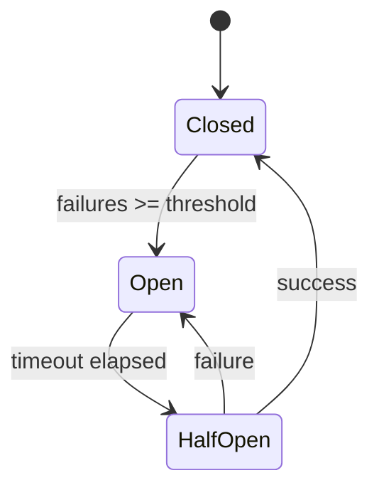

# RLM v2.4: Production Patterns SDD

## System Design Document

**Версия:** 2.4.0  
**Дата:** 2026-02-02  
**Автор:** AI-DLC  
**Статус:** Draft  
**Источники:** 
- "7 Layers of Production-Grade Agentic AI" (Fareed Khan)
- "2026 AI Agent Mastery Blueprint" (Gaurav Shrivastav)

---

## 1. Executive Summary

RLM Toolkit v2.3.0 покрывает ~75% industry best practices для production agentic systems. 
Эта версия закрывает критические gaps для enterprise-ready deployments.

### Gap Analysis

| Component | Current | Target | Priority |
|-----------|---------|--------|----------|
| Autonomy Model | Implicit | Explicit L1-L5 | **P0** |
| LLM Resilience | None | CircuitBreaker | **P0** |
| Middleware | Ad-hoc callbacks | Structured chain | P1 |
| Reflection | SelfRefine only | ReflectionCallback | P1 |
| Task Decomposition | Basic chunking | DAG Planner | P1 |

---

## 2. Требования

### REQ-2.4.1: AutonomyLevel Enum (P0)

**Описание:** Явная модель уровней автономности для RLMConfig.

```python
class AutonomyLevel(IntEnum):
    HUMAN_ASSISTED = 1      # Every action requires approval
    HUMAN_SUPERVISED = 2    # Monitoring with override capability
    CONDITIONAL = 3         # Autonomous with human fallback
    HIGH_AUTONOMY = 4       # Self-evolving with periodic review
    FULL_AUTONOMY = 5       # Completely self-sufficient
```

**Acceptance Criteria:**
- [ ] Enum добавлен в `rlm_toolkit/core/config.py`
- [ ] RLMConfig принимает `autonomy_level` параметр
- [ ] Default = HUMAN_SUPERVISED (L2)
- [ ] Документация обновлена

---

### REQ-2.4.2: CircuitBreaker (P0)

**Описание:** Защита от cascade failures при недоступности LLM providers.

**States:**
```
CLOSED → (failures >= threshold) → OPEN
OPEN → (timeout elapsed) → HALF_OPEN
HALF_OPEN → (success) → CLOSED
HALF_OPEN → (failure) → OPEN
```

**Acceptance Criteria:**
- [ ] CircuitBreaker класс в `rlm_toolkit/providers/resilience.py`
- [ ] Интеграция со всеми providers
- [ ] Configurable threshold (default=5) и timeout (default=60s)
- [ ] Raises `CircuitOpenError` when open
- [ ] Metrics: failures_count, state_changes, recovery_time

---

### REQ-2.4.3: MiddlewareChain (P1)

**Описание:** Structured request/response processing pipeline.

```python
class MiddlewareChain:
    middlewares: List[Middleware]
    
    async def process(self, request: Request) -> Response:
        # Pre-processing
        for m in self.middlewares:
            request = await m.before(request)
        
        # Core handler
        response = await self.handler(request)
        
        # Post-processing (reverse order)
        for m in reversed(self.middlewares):
            response = await m.after(response)
        
        return response
```

**Built-in Middlewares:**
- `LoggingMiddleware` — structured logging with correlation IDs
- `MetricsMiddleware` — latency, token counts, costs
- `AuthMiddleware` — API key management
- `RateLimitMiddleware` — per-provider limits
- `ErrorHandlingMiddleware` — graceful degradation

**Acceptance Criteria:**
- [ ] Middleware base class и chain в `rlm_toolkit/middleware/`
- [ ] 5 built-in middlewares
- [ ] Backward compatible with existing callbacks
- [ ] Configurable via RLMConfig

---

### REQ-2.4.4: ReflectionCallback (P1)

**Описание:** Agent introspection pattern для self-evaluation.

```python
class ReflectionCallback(Callback):
    """Автоматическая саморефлексия после каждого action."""
    
    def on_action_end(self, action: Action, result: Result):
        reflection = self.llm.generate(
            f"Evaluate this action:\n{action}\nResult:\n{result}\n"
            "Was this effective? What could be improved?"
        )
        self.memory.store(f"reflection:{action.id}", reflection)
```

**Acceptance Criteria:**
- [ ] ReflectionCallback в `rlm_toolkit/callbacks/reflection.py`
- [ ] Configurable reflection frequency (every N actions)
- [ ] Integration with H-MEM for reflection storage
- [ ] Optional: LLM-based quality scoring

---

### REQ-2.4.5: TaskPlanner with DAG (P1)

**Описание:** Goal decomposition с dependency-aware execution.

```python
class TaskPlanner:
    def decompose(self, goal: str) -> List[SubTask]:
        """Use LLM to break goal into subtasks."""
        
    def create_dag(self, subtasks: List[SubTask]) -> ExecutionDAG:
        """Build dependency graph for parallel execution."""
        
    async def execute(self, dag: ExecutionDAG) -> List[Result]:
        """Execute with parallelism where dependencies allow."""
```

**Acceptance Criteria:**
- [ ] TaskPlanner в `rlm_toolkit/planning/planner.py`
- [ ] SubTask dataclass с dependencies
- [ ] DAG execution engine with topological sort
- [ ] Parallel execution for independent tasks
- [ ] Progress callbacks и cancellation support

---

## 3. Архитектура

### 3.1 Updated 7-Layer Stack

```
┌─────────────────────────────────────────────────────────────┐
│ L7: Service Layer                                           │
│     GoMCP v3.0.0 ✅ | MCP Python ✅                         │
├─────────────────────────────────────────────────────────────┤
│ L6: Agent Orchestration                                     │
│     MultiAgentRuntime ✅ | TaskPlanner [NEW] | Reflection   │
├─────────────────────────────────────────────────────────────┤
│ L5: Security & Guardrails                                   │
│     SecureREPL ✅ | TrustZones ✅ | CIRCLE ✅               │
├─────────────────────────────────────────────────────────────┤
│ L4: Memory Management                                       │
│     H-MEM L0-L3 ✅ | InfiniRetri ✅ | Memory Bridge ✅      │
├─────────────────────────────────────────────────────────────┤
│ L3: Context Management                                      │
│     Engine State ✅ | AutonomyLevel [NEW]                   │
├─────────────────────────────────────────────────────────────┤
│ L2: Middleware                                              │
│     MiddlewareChain [NEW] | Callbacks ✅                    │
├─────────────────────────────────────────────────────────────┤
│ L1: LLM Provider Layer                                      │
│     75 Providers ✅ | CircuitBreaker [NEW] | ModelRotation  │
└─────────────────────────────────────────────────────────────┘
```

### 3.2 CircuitBreaker State Machine



### 3.3 Middleware Chain Flow

```
Request → [Logging] → [Metrics] → [Auth] → [RateLimit] → Handler
                                                            ↓
Response ← [Logging] ← [Metrics] ← [Auth] ← [RateLimit] ← Result
```

---

## 4. Implementation Tasks

### Phase 1: Core Autonomy & Resilience (P0) — 8h

| Task | File | Effort |
|------|------|--------|
| 1.1 AutonomyLevel enum | `core/config.py` | 2h |
| 1.2 CircuitBreaker class | `providers/resilience.py` | 4h |
| 1.3 Provider integration | `providers/base.py` | 2h |

### Phase 2: Middleware System (P1) — 10h

| Task | File | Effort |
|------|------|--------|
| 2.1 Middleware base class | `middleware/base.py` | 2h |
| 2.2 MiddlewareChain | `middleware/chain.py` | 3h |
| 2.3 Built-in middlewares | `middleware/builtin/` | 4h |
| 2.4 RLMConfig integration | `core/config.py` | 1h |

### Phase 3: Reflection & Planning (P1) — 20h

| Task | File | Effort |
|------|------|--------|
| 3.1 ReflectionCallback | `callbacks/reflection.py` | 4h |
| 3.2 TaskPlanner | `planning/planner.py` | 8h |
| 3.3 ExecutionDAG | `planning/dag.py` | 6h |
| 3.4 Tests | `tests/test_planning.py` | 2h |

**Total Estimate:** ~38-40h

---

## 5. Migration & Compatibility

### Backward Compatibility

- Existing `callbacks` continue to work
- MiddlewareChain is opt-in via `RLMConfig(use_middleware=True)`
- Default `autonomy_level=AutonomyLevel.HUMAN_SUPERVISED`
- CircuitBreaker enabled by default, configurable

### Breaking Changes

**None** — all new features are additive.

---

## 6. Success Metrics

| Metric | Target | Measurement |
|--------|--------|-------------|
| Provider resilience | 99.9% uptime | CircuitBreaker recovery rate |
| Request latency | <100ms overhead | Middleware chain timing |
| Reflection quality | >0.7 correlation | Reflection scores vs outcomes |
| Task parallelism | 2x speedup | DAG execution vs sequential |

---

## 7. Open Questions

1. Should CircuitBreaker be per-provider or global?
2. Middleware chain: sync or async-first?
3. TaskPlanner: use separate LLM for decomposition?

---

## 8. Approval

- [ ] Technical review
- [ ] User approval  
- [ ] Implementation start

---

**Next Step:** Утверждение и старт Phase 1 (AutonomyLevel + CircuitBreaker)
